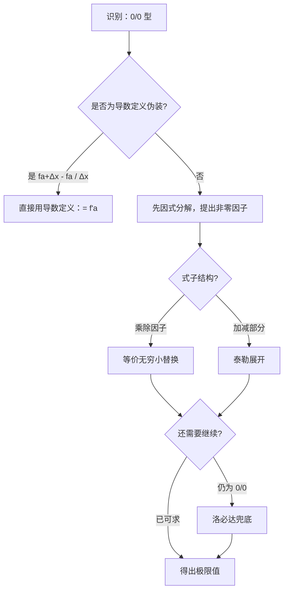

# 题型一：$\frac{0}{0}$ 型极限

## 识别特征

- 分子分母同时趋于 0
- 含 $\sin x - x$、$\ln(1+x)-x$、$\tan x - x$ 等结构
- 极限式中出现 $f(x_0 + \Delta x) - f(x_0)$ 结构（导数定义伪装）

## 解题流程

## 通法步骤

1. 先因式分解，提出非零因子
2. 乘除因子用**等价无穷小替换**
3. 加减部分用**泰勒展开**（记住：分母 $x^n$ → 分子展到 $x^n$）
4. 若仍复杂，洛必达兜底

## 常见陷阱

- 加减法中错误使用等价替换（如 $\tan x - \sin x$ 直接替换为 $x - x = 0$）
- 泰勒展开阶数不够导致精度丢失

## 跨章节连接 → Ch02 导数定义

一部分 $\frac{0}{0}$ 型极限实际上是**导数定义的伪装**。识别信号：极限式中出现 $f(x_0 + \Delta x) - f(x_0)$ 结构。

> *极简例子：* $\displaystyle \lim_{h \to 0} \frac{e^{h} - 1}{h} = (e^x)'|_{x=0} = 1$，比洛必达更快。

## 经典母题

> **题目**：求 $\displaystyle \lim_{x \to 0} \frac{\tan x - \sin x}{x^3}$

**解析**：
$$
\begin{aligned}
\lim_{x \to 0} \frac{\tan x - \sin x}{x^3}
&= \lim_{x \to 0} \frac{\sin x (\frac{1}{\cos x} - 1)}{x^3} \quad \text{（提公因子，回避加减法等价替换陷阱）}\\
&= \lim_{x \to 0} \frac{\sin x \cdot \frac{1-\cos x}{\cos x}}{x^3} \\
&= \lim_{x \to 0} \frac{x \cdot \frac{x^2}{2} \cdot \frac{1}{\cos x}}{x^3} \quad \text{（$\sin x \sim x$, $1-\cos x \sim \frac{x^2}{2}$）}\\
&= \lim_{x \to 0} \frac{1}{2\cos x} = \frac{1}{2}
\end{aligned}
$$

**复盘**：直接替换 $\tan x \sim x$，$\sin x \sim x$ 得 $0/x^3=0$ 是经典错误——消去了一阶项后剩余高阶项才是答案。
