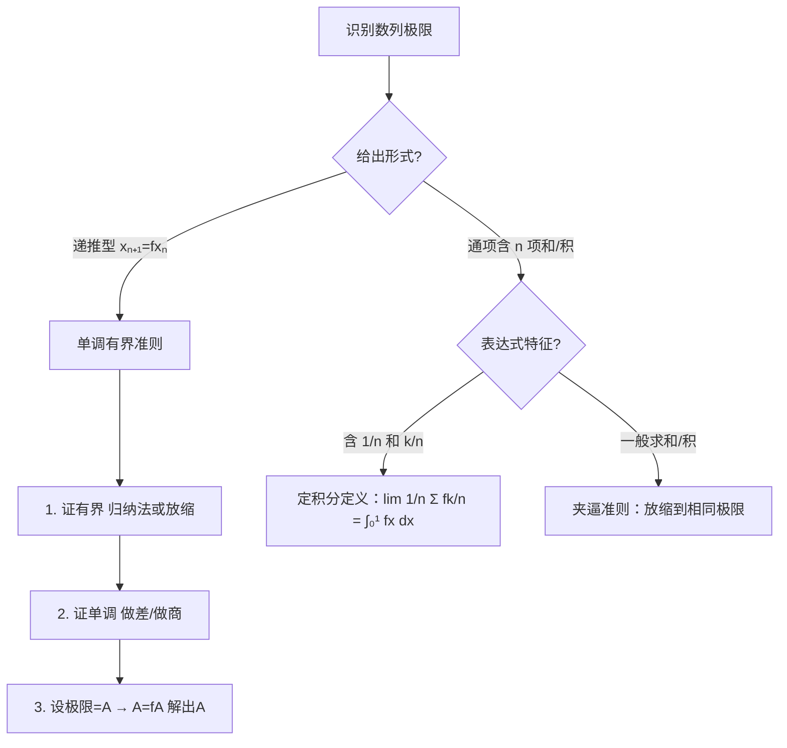

# 题型三：数列极限（递推型 / 通项型）

## 识别特征

- 求 $\lim\limits_{n \to \infty} x_n$，给出 $x_{n+1} = f(x_n)$
- 或通项含 $n$ 项求和、乘积

## 解题流程

## 通法步骤

**递推型**：
1. 单调有界准则：先证单调 + 有界
2. 设 $\lim x_n = A$，代入递推式解 $A = f(A)$

**通项型（含 $n$ 项和/积）**：
1. 夹逼准则：放缩到相同极限
2. 或转化为定积分 $\lim \frac{1}{n} \sum f(\frac{k}{n}) = \int_0^1 f(x)dx$

## 跨章节连接 → Ch05 定积分定义

当极限表达式可写为 $\displaystyle \lim_{n \to \infty} \frac{1}{n} \sum_{k=1}^{n} f\!\left(\frac{k}{n}\right)$ 形式时，这就是**定积分的定义**，直接等于 $\displaystyle \int_0^1 f(x)\,dx$。

**识别口诀**：**"n项和，每项有 1/n，括号里有 k/n → 定积分定义"**

> *极简例子：* $\displaystyle \lim_{n \to \infty} \frac{1}{n} \sum_{k=1}^{n} \sin\frac{k\pi}{n} = \int_0^1 \sin(\pi x)\,dx = \frac{2}{\pi}$

## 经典母题

> **题目**：设 $x_1 = \sqrt{2}$, $x_{n+1} = \sqrt{2 + x_n}$，求 $\lim\limits_{n \to \infty} x_n$。

**解析**：
1. **证明有界**：归纳法易证 $x_n < 2$
2. **证明单调增**：$x_{n+1}^2 - x_n^2 = (2+x_n) - x_n^2$。$g(t)=2+t-t^2$ 在 $t \in (0,2)$ 上 $>0$，故 $x_{n+1} > x_n$
3. **求极限**：设 $\lim x_n = A$，代入 $A = \sqrt{2+A}$，解得 $A=2$（$A=-1$ 舍去）

$\therefore \lim\limits_{n \to \infty} x_n = 2$
