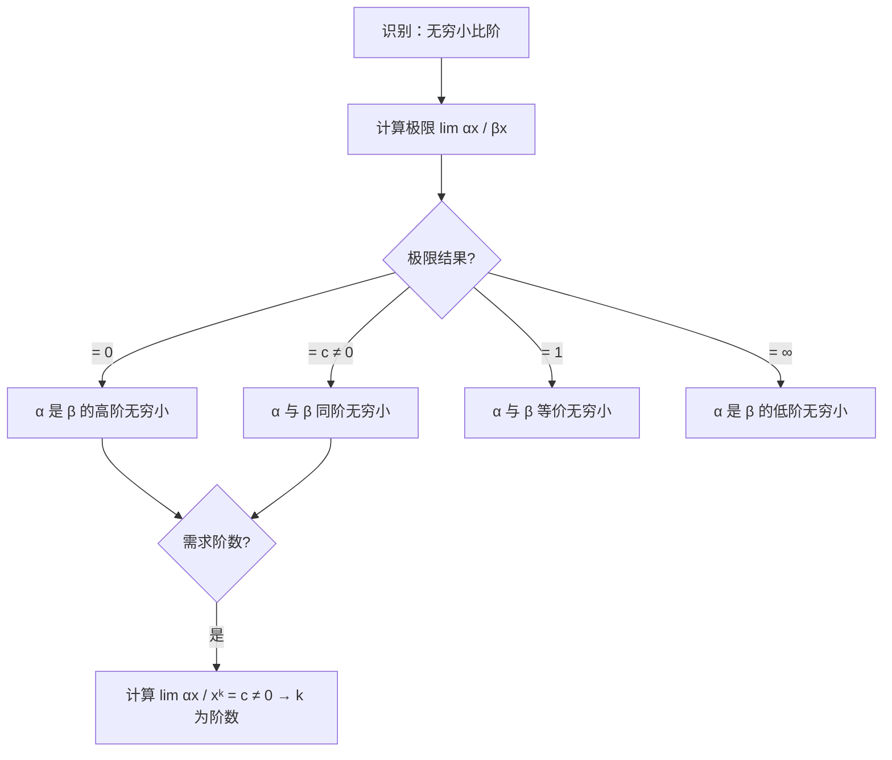

# 题型四：无穷小比阶

## 识别特征

- 题干问"当 $x \to 0$ 时，$\alpha(x)$ 是 $\beta(x)$ 的什么无穷小"
- 给定阶数求参数

## 解题流程

## 通法步骤

1. 计算 $\lim \frac{\alpha(x)}{\beta(x)}$ 或 $\lim \frac{\alpha(x)}{x^k} = c \neq 0$
2. 综合运用等价代换、泰勒展开
3. 注意精度：**阶数由首项非零展开项决定**

## 常见陷阱

- 直接用等价替换而忽略了高阶项
- 泰勒展开精度不够，漏掉了首项非零的低阶项

## 经典母题

> **题目**（真题改编）：当 $x \to 0$ 时，$f(x) = x - \sin x$ 是 $x$ 的几阶无穷小？

**解析**：
泰勒展开 $\sin x = x - \frac{x^3}{3!} + \frac{x^5}{5!} + o(x^5)$

$\therefore f(x) = x - \left(x - \frac{x^3}{6} + o(x^3)\right) = \frac{x^3}{6} + o(x^3)$

$\lim\limits_{x \to 0} \frac{f(x)}{x^3} = \frac{1}{6} \neq 0$，故为 **3 阶无穷小**。
