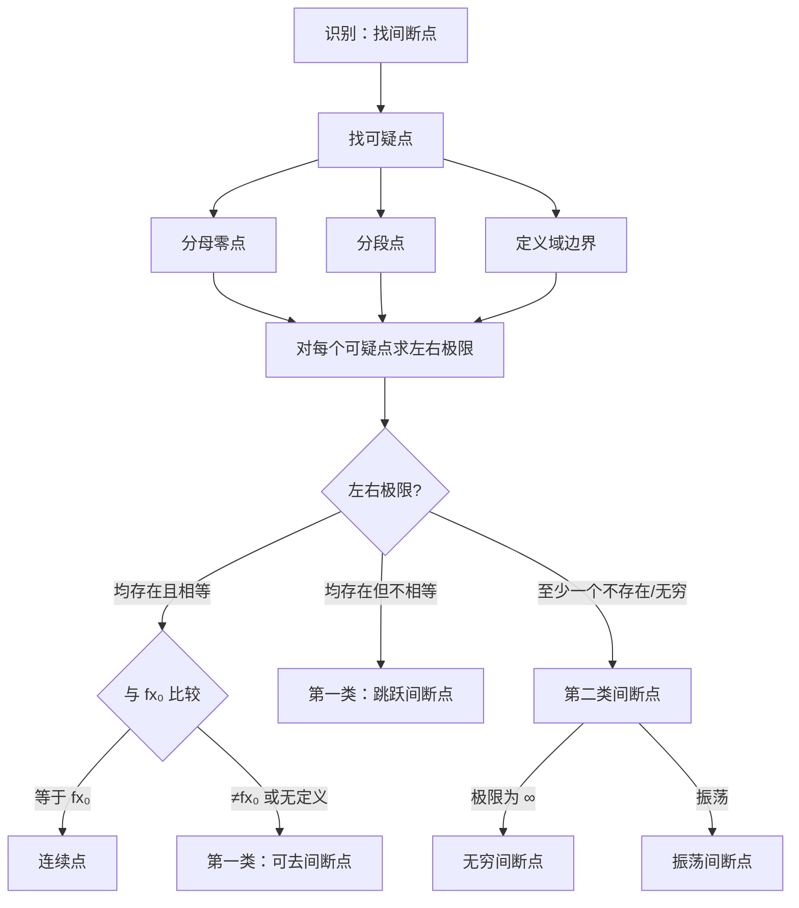

# 题型五：间断点判定与类型分类

## 识别特征

- 题干给出分段函数或含分母/三角/对数的函数
- 问间断点及其类型

## 解题流程

## 通法步骤

1. 找「可疑点」：分母零点、分段点、定义域边界
2. 对每个可疑点，求左右极限
3. 比较左右极限与函数值，按分类表判定

## 常见陷阱

- 忘记求**左右**极限而只看单侧——跳跃间断点需要两侧都存在但不相等
- 可去间断点：极限存在但不等于函数值（或函数无定义）
- 分段点处容易漏判

## 经典母题

> **题目**（真题）：讨论函数 $f(x) = \frac{e^{x} - 1}{x(x-1)}$ 的间断点及其类型。

**解析**：
- **可疑点**：$x=0$（分母零点）、$x=1$（分母零点）

**$x=0$**：
$$
\lim_{x \to 0} \frac{e^x-1}{x(x-1)} = \lim_{x \to 0} \frac{x}{x(x-1)} = \lim_{x \to 0} \frac{1}{x-1} = -1
$$
左极限=右极限=-1（存在有限），但 $f(0)$ 无定义 → **第一类可去间断点**

**$x=1$**：
$$
\lim_{x \to 1} \frac{e^x-1}{x(x-1)} = \lim_{x \to 1} \frac{e-1}{1 \cdot (x-1)} = \infty
$$
→ **第二类无穷间断点**
