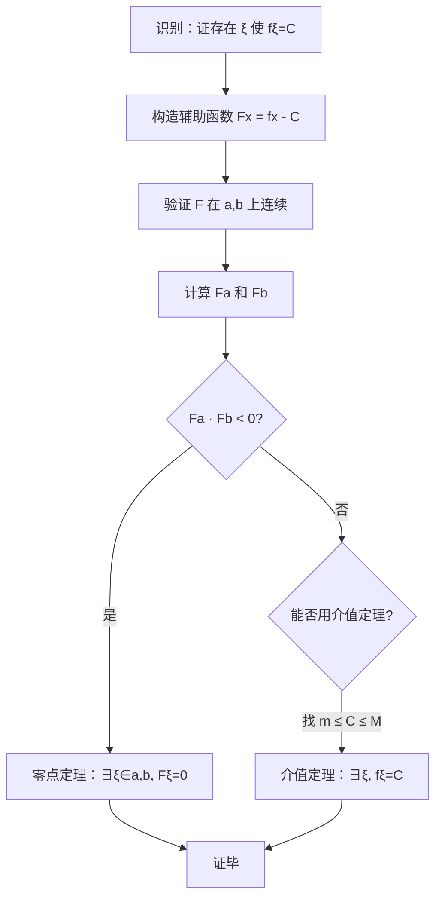

# 题型六：闭区间上连续函数性质应用

## 识别特征

- "证明存在 $\xi$ 使得 $f(\xi) = C$"
- "证明方程在 $(a,b)$ 内有根"
- 涉及零点定理或介值定理

## 解题流程

## 通法步骤

1. 构造辅助函数 $F(x) = f(x) - C$（零点定理）或利用介值定理直接
2. 验证 $F$ 在 $[a,b]$ 上连续
3. 验证 $F(a) \cdot F(b) < 0$（零点定理）或找到两个函数值夹住目标值（介值定理）

## 跨章节连接 → Ch03 中值定理（罗尔定理）

零点定理是**罗尔定理的直接前置**。构造辅助函数这个核心技法，在本章首次出现，在 Ch03 全面爆发。

| 技法演进 | 本章 (Ch01) | Ch03 升级版 |
|---------|------------|------------|
| 辅助函数 | $F(x) = f(x) - C$（简单移项） | $F(x) = e^{\varphi(x)}[f(x) - C]$（乘积分因子） |
| 目标 | 证 $F(\xi) = 0$ | 证 $F'(\xi) = 0$（找原函数！） |

## 常见陷阱

- 忘记验证连续性（零点定理的前提条件）
- 辅助函数构造错误（移项时符号搞反）

## 经典母题

> **题目**：证明方程 $x = e^{x-2}$ 在 $(0,1)$ 内至少有一个实根。

**解析**：
令 $F(x) = x - e^{x-2}$，$F$ 在 $[0,1]$ 上连续。

$F(0) = 0 - e^{-2} = -e^{-2} < 0$

$F(1) = 1 - e^{-1} = 1 - \frac{1}{e} > 0$

由零点定理，$\exists \xi \in (0,1)$ 使得 $F(\xi) = 0$，即 $\xi = e^{\xi-2}$。$\square$
