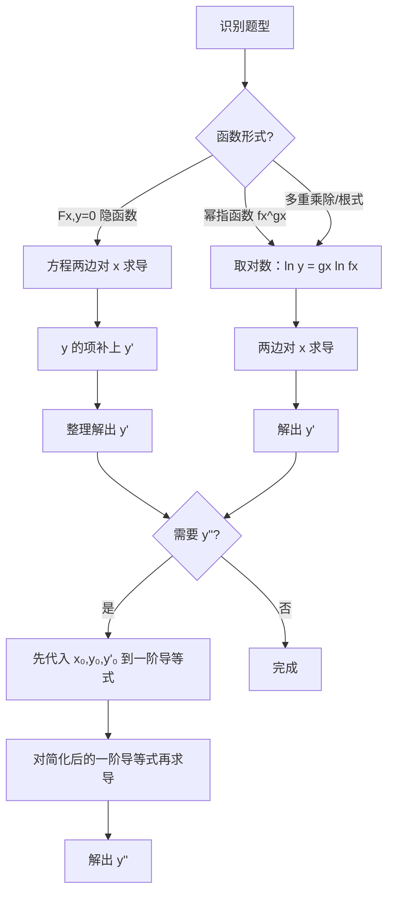

# 题型二：隐函数求导（含对数求导法）

## 识别特征

- 方程 $F(x,y)=0$ 给出 $y=y(x)$，求 $y'$ 或 $y''$
- 函数形如 $f(x)^{g(x)}$（幂指函数）
- 含多重乘除/根式的复杂显函数

## 解题流程

## 通法步骤

1. **隐函数**：方程两边对 $x$ 求导，$y$ 的项补上 $y'$；整理解出 $y'$
2. **幂指函数**：取对数 $\ln y = g(x)\ln f(x)$，再两边求导；或化为 $e^{g(x)\ln f(x)}$
3. 求二阶导：先代入 $x=?, y=?, y'=?$ 再对一阶导等式继续求导

## 常见陷阱

- 求二阶导时忘记 $y$ 和 $y'$ 仍是 $x$ 的函数，漏链式法则
- 对数求导时忘记处理 $y<0$ 的情况（用 $\ln|y|$ 规避）
- 二阶导求完后忘记代入已知值化简

## 经典母题

> **题目**（2002数一真题）：函数 $y=y(x)$ 由方程 $e^y + 6xy + x^2 - 1 = 0$ 确定，求 $y''(0)$。

**解析**：
① 当 $x=0$ 时，代入原方程：$e^{y(0)} - 1 = 0 \Rightarrow y(0) = 0$

② 方程两边对 $x$ 求导：
$$e^y y' + 6y + 6xy' + 2x = 0$$
代入 $(0,0)$ 得：$1 \cdot y'(0) + 0 + 0 + 0 = 0 \Rightarrow y'(0) = 0$

③ 对导式再求导（注意 $e^y y'$ 是乘积！）：
$$e^y(y')^2 + e^y y'' + 6y' + 6y' + 6xy'' + 2 = 0$$
代入 $(0,0,0)$：$0 + y''(0) + 0 + 0 + 0 + 2 = 0 \Rightarrow y''(0) = -2$
