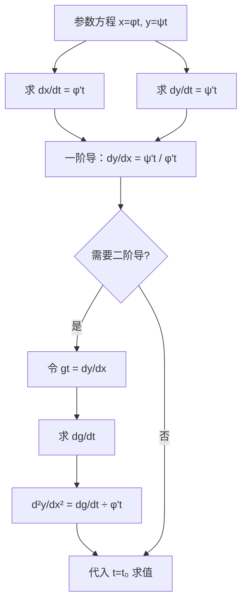

# 题型三：参数方程求导（一阶 + 二阶）

## 识别特征

- 函数由 $\begin{cases} x = \varphi(t) \\ y = \psi(t) \end{cases}$ 给出
- 需在某参数值 $t=t_0$ 处求一阶或二阶导数值
- 可能结合变限积分（如 $y = \int_0^t f(u)du$）

## 解题流程

## 通法步骤

1. 一阶：$\frac{dy}{dx} = \frac{\psi'(t)}{\varphi'(t)}$
2. 二阶：$\frac{d^2y}{dx^2} = \frac{d}{dt}\!\left(\frac{dy}{dx}\right) \big/ \varphi'(t)$
3. 代入指定 $t$ 值求数值

## 常见陷阱

- **二阶导直接写 $\frac{\psi''(t)}{\varphi''(t)}$** ——经典错误！
- 求二阶导时忘记再除以 $\varphi'(t)$
- $t$ 的取值对应多个点（如 $t = \pm 1$），需逐一讨论

## 经典母题

> **题目**（2010数一真题）：设 $\begin{cases} x = e^{-t} \\ y = \int_0^t \ln(1+u^2)du \end{cases}$，求 $\left.\frac{d^2y}{dx^2}\right|_{t=0}$。

**解析**：
$$\frac{dx}{dt} = -e^{-t}, \quad \frac{dy}{dt} = \ln(1+t^2)$$

$$\frac{dy}{dx} = \frac{\ln(1+t^2)}{-e^{-t}} = -e^t \ln(1+t^2)$$

$$\frac{d^2y}{dx^2} = \frac{d}{dt}\!\left[-e^t \ln(1+t^2)\right] \big/ (-e^{-t}) = \left[-e^t\ln(1+t^2) - e^t\cdot\frac{2t}{1+t^2}\right] \cdot (-e^t)$$

代入 $t=0$：$\ln(1+0)=0$, $\frac{2\cdot 0}{1+0}=0$，故 $\left.\frac{d^2y}{dx^2}\right|_{t=0} = 0$
