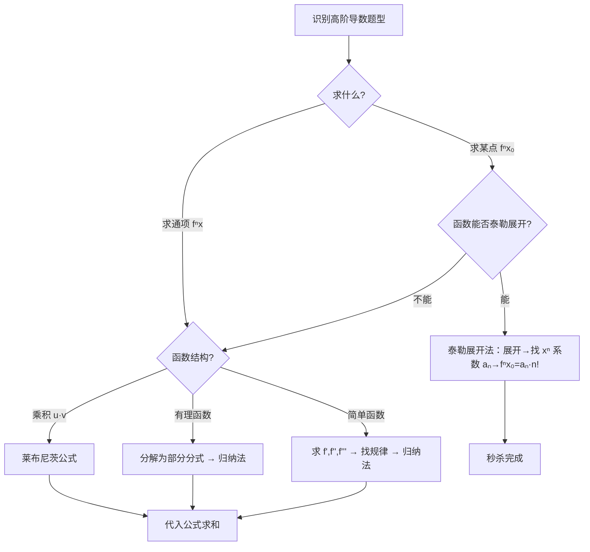

# 题型四：高阶导数计算

## 识别特征

- 题干要求 $f^{(n)}(x)$ 的通项公式
- 求某点的高阶导数值 $f^{(n)}(x_0)$
- 函数为乘积形式（如 $x^k \cdot g(x)$）

## 解题流程

## 三种武器对比

| 武器 | 适用信号 | 优点 | 缺点 |
|------|---------|------|------|
| **归纳法** | 函数简单 + 求通项 | 直接，可求任意 n | 需找规律 |
| **莱布尼茨** | 两个因子乘积 + 一个因子高阶导为 0 | 一步到位 | 需组合数计算 |
| **泰勒展开** | 仅求**某点**的 $f^{(n)}(x_0)$ | 最快！ | 需掌握展开式 |

**判断依据**：
- 题目问 $f^{(n)}(0)$ → 首选泰勒展开
- 题目问 $f^{(n)}(x)$ 通项 → 用归纳法或分解法
- $(x^n \cdot g(x))^{(n)}$ → 莱布尼茨（$(x^n)^{(k)} = 0$ 当 $k > n$）

## 常见陷阱

- 莱布尼茨公式忘记组合数 $\binom{n}{k}$
- 泰勒展开法：忘记 $f^{(n)}(x_0) = a_n \cdot n!$
- 归纳法：符号规律容易搞错（尤其是 $(-1)^n$ 的位置）

## 经典母题

### 母题 1（归纳法）

求 $y = \frac{1}{x(1-x)}$ 的 n 阶导数。

**解析**：先分解：$y = \frac{1}{x} + \frac{1}{1-x}$

$$\left(\frac{1}{x}\right)^{(n)} = (-1)^n \frac{n!}{x^{n+1}}, \quad \left(\frac{1}{1-x}\right)^{(n)} = \frac{n!}{(1-x)^{n+1}}$$

$$y^{(n)} = (-1)^n \frac{n!}{x^{n+1}} + \frac{n!}{(1-x)^{n+1}}$$

### 母题 2（泰勒展开法，秒杀！）

求 $f^{(n)}(0)$，其中 $f(x) = \frac{x}{1-x-2x^2}$。

**解析**：$(1-x-2x^2) = (1-2x)(1+x)$

$$f(x) = \frac{x}{1-x-2x^2} = \frac{1}{3}\left(\frac{1}{1-2x} - \frac{1}{1+x}\right) = \frac{1}{3}\left[\sum_{n=0}^{\infty} (2x)^n - \sum_{n=0}^{\infty} (-x)^n\right]$$

$$= \frac{1}{3} \sum_{n=0}^{\infty} [2^n - (-1)^n] x^n$$

$x^n$ 的系数为 $a_n = \frac{2^n - (-1)^n}{3}$，故 $f^{(n)}(0) = a_n \cdot n! = \frac{2^n - (-1)^n}{3} \cdot n!$
