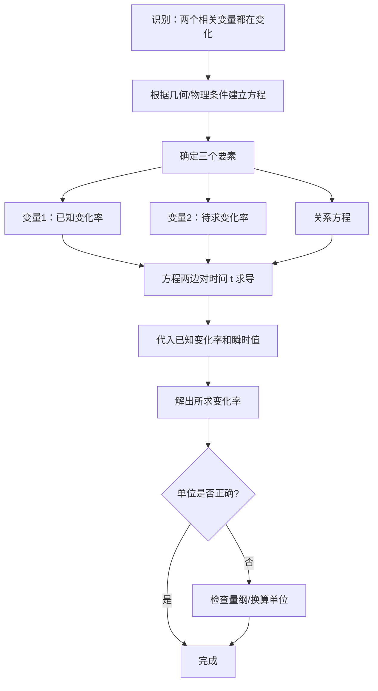

# 题型五：相关变化率

## 识别特征

- 题干描述两个量都在变化，已知一个变化率（如 $\frac{dx}{dt}$），求另一个（如 $\frac{dy}{dt}$）
- 涉及几何图形（圆、球、三角形等）或物理场景
- 关键词："速率""增加率""变化速度"

## 解题流程

## 通法步骤

1. 根据几何/物理条件建立两个变量之间的**方程**
2. 方程两边对**时间 $t$** 求导（链式法则！）
3. 代入已知变化率和瞬时值，解出所求变化率

## 常见陷阱

- 忘记链式法则——对 $t$ 求导时中间变量必须补上其导数
- 瞬时值代入时机：先求导再代值，不能先代值再求导
- 单位不统一（如 cm 和 m 混用）

## 经典母题

> **题目**：一气球从离观察员 500 m 处铅直上升，速率为 140 m/min。当气球高度为 500 m 时，观察员视线仰角的增加率是多少？

**解析**：
设高度 $h$，仰角 $\alpha$，则 $\tan\alpha = \frac{h}{500}$

两边对 $t$ 求导：$\sec^2\alpha \cdot \frac{d\alpha}{dt} = \frac{1}{500} \cdot \frac{dh}{dt}$

当 $h=500$ 时，$\tan\alpha = 1$，$\sec^2\alpha = 1 + \tan^2\alpha = 2$

代入 $\frac{dh}{dt} = 140$：$2 \cdot \frac{d\alpha}{dt} = \frac{140}{500} \Rightarrow \frac{d\alpha}{dt} = 0.14$ rad/min
