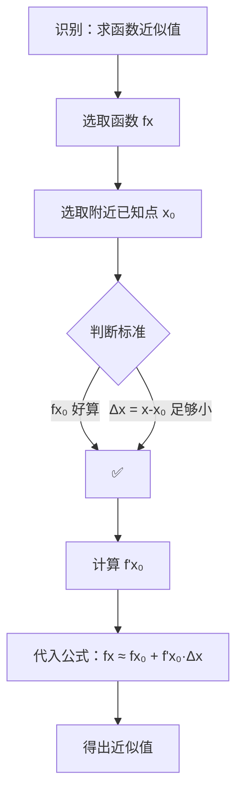

# 题型六：微分近似计算

## 识别特征

- 求 $\sqrt{}$、$e^{\square}$、$\ln(\square)$、$\sin \square$ 等函数的近似值
- 题干含"近似计算""近似值""估算"等关键词

## 解题流程

## 通法步骤

1. 选取附近的已知点 $x_0$（使 $f(x_0)$ 好算）
2. $\Delta x = x - x_0$
3. $f(x) \approx f(x_0) + f'(x_0)\Delta x$

## 常见陷阱

- $x_0$ 选得过远 → 近似误差大
- 忘记求导：$f(x) \approx f(x_0) + \Delta x$ 是错的，系数必须是 $f'(x_0)$
- 微分近似是**线性近似**，只适用于 $|\Delta x|$ 很小的情形

## 常用近似公式（$|x|$ 很小时）

| 公式 | 来源 |
|------|------|
| $\sin x \approx x$ | $f(x)=\sin x$, $x_0=0$ |
| $\tan x \approx x$ | $f(x)=\tan x$, $x_0=0$ |
| $e^x \approx 1+x$ | $f(x)=e^x$, $x_0=0$ |
| $\ln(1+x) \approx x$ | $f(x)=\ln(1+x)$, $x_0=0$ |
| $(1+x)^\alpha \approx 1+\alpha x$ | $f(x)=(1+x)^\alpha$, $x_0=0$ |

## 经典母题

> **题目**：求 $\sqrt{4.1}$ 的近似值。

**解析**：
取 $f(x) = \sqrt{x}$, $x_0 = 4$, $\Delta x = 0.1$

$f'(x) = \frac{1}{2\sqrt{x}}$，$f'(4) = \frac{1}{4}$

$$\sqrt{4.1} \approx f(4) + f'(4) \cdot 0.1 = 2 + \frac{0.1}{4} = 2.025$$

（精确值 $\sqrt{4.1} \approx 2.0248\ldots$，误差仅 $0.01\%$）
