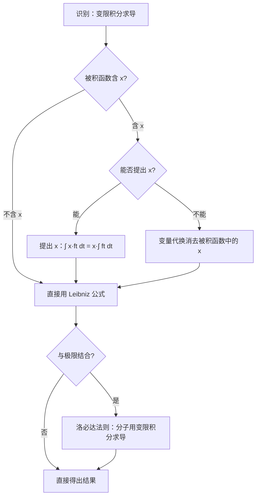

# 题型七：变限积分求导

## 识别特征

- 题干含 $\frac{d}{dx} \int_{\square}^{\square} f(t)dt$ 形式
- 极限式中出现变限积分与 $x^k$ 的比值（$\frac{0}{0}$ 型 → 洛必达）
- 被积函数含参数 $x$

## 解题流程

## 核心公式

**基本形式**：
$$\frac{d}{dx} \int_a^x f(t) dt = f(x)$$

**一般形式（考研核心）**：
$$\frac{d}{dx} \int_{a(x)}^{b(x)} f(t) dt = f(b(x)) \cdot b'(x) - f(a(x)) \cdot a'(x)$$

口诀：**「上限代入 × 上限导 − 下限代入 × 下限导」**

**含参形式**：
$$\frac{d}{dx} \int_{a(x)}^{b(x)} f(x, t) dt = \int_{a(x)}^{b(x)} \frac{\partial f(x,t)}{\partial x} dt + f(x, b(x)) \cdot b'(x) - f(x, a(x)) \cdot a'(x)$$

## 常见陷阱

- 被积函数含 $x$ 时不能直接套基本公式——必须先**提出 $x$** 或**变量代换**
- 上下限调换：$\int_{b(x)}^{a(x)} = -\int_{a(x)}^{b(x)}$
- 洛必达时忘记链式法则：$\frac{d}{dx} \int_0^{x^2} f(t)dt = f(x^2) \cdot 2x$
- 结果中的自变量是 $x$ 而非 $t$（$t$ 是哑变量）

## 经典母题

### 母题 1（被积函数含 x——需变量代换）

设 $F(x) = \int_0^x t f(x^2 - t^2) dt$，其中 $f$ 可导，求 $F'(x)$。

**解析**：令 $u = x^2 - t^2$，则 $du = -2t dt$，即 $t dt = -\frac{1}{2} du$

当 $t = 0$ 时 $u = x^2$；当 $t = x$ 时 $u = 0$

$$F(x) = \int_{x^2}^{0} f(u) \cdot \left(-\frac{1}{2}\right) du = \frac{1}{2} \int_0^{x^2} f(u) du$$

$$F'(x) = \frac{1}{2} \cdot f(x^2) \cdot 2x = x f(x^2)$$

### 母题 2（与洛必达结合——真题模式）

求极限 $\displaystyle \lim_{x \to 0} \frac{\int_0^x (e^{t^2} - 1) dt}{x^3}$。

**解析**：$\frac{0}{0}$ 型，用洛必达法则：

$$\lim_{x \to 0} \frac{\int_0^x (e^{t^2} - 1) dt}{x^3} = \lim_{x \to 0} \frac{e^{x^2} - 1}{3x^2} = \lim_{x \to 0} \frac{x^2}{3x^2} = \frac{1}{3}$$

### 母题 3（含参 + 二阶导）

设 $\varphi(x) = \int_0^x (x-t) f(t) dt$，其中 $f$ 连续，求 $\varphi'(x)$ 和 $\varphi''(x)$。

**解析**：
$\varphi(x) = x \int_0^x f(t) dt - \int_0^x t f(t) dt$

$$\varphi'(x) = \int_0^x f(t) dt + x \cdot f(x) - x f(x) = \int_0^x f(t) dt$$

$$\varphi''(x) = f(x)$$

启示：$\int_0^x (x-t)f(t)dt$ 是 $f(x)$ 的**二次原函数**——这个结构在考研中反复出现！
