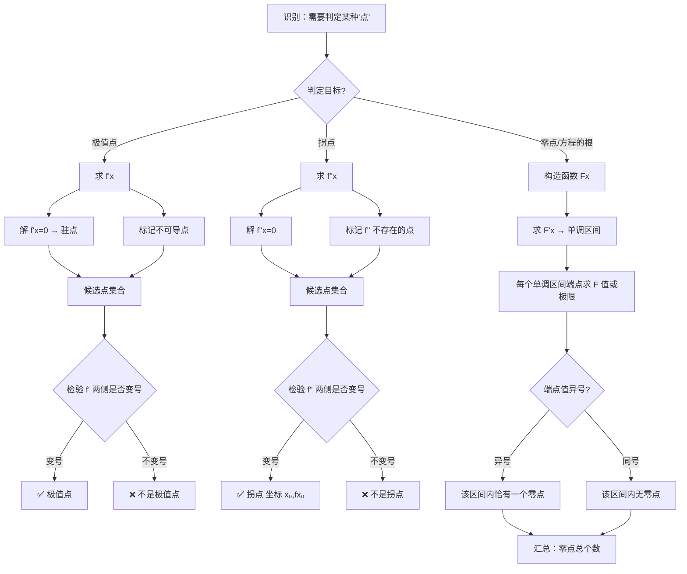
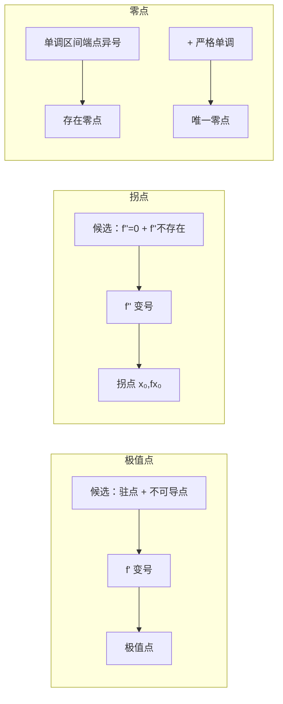

# 题型八：极值点、拐点、零点判定

## 识别特征

- 题干出现"极值点""拐点""零点个数""方程的根""凹凸区间"等关键词
- 给出 $f'(x)$ / $f''(x)$ 的图像或表格信息
- 概念辨析选择题："下列说法正确的是"

## 解题流程

## 极值点 vs 拐点 vs 零点 对比

## 常见陷阱

- **极值点 ≠ 驻点**：不可导点也可能是极值点（$|x|$ 在 $x=0$）
- **拐点 ≠ $f''(x_0)=0$**：$f''$ 不存在的点也可能是拐点（$x^{1/3}$ 在 $x=0$）
- **拐点坐标**：答案必须写成 $(x_0, f(x_0))$，只写 $x_0$ 不得分
- **极值点 vs 最值点**：极值是局部概念，最值是全局概念
- **混淆 $f'$ 与 $f''$ 的用途**：$f'$ 变号 → 极值点，$f''$ 变号 → 拐点

## 经典母题

### 母题 1（拐点坐标计算）

求曲线 $y = x^4 - 6x^3 + 12x^2 - 8x$ 的拐点。

**解析**：
$$y'' = 12x^2 - 36x + 24 = 12(x-1)(x-2)$$

列表检验 $y''$ 在 $x=1,2$ 两侧是否变号：

| $x$ | $(-\infty, 1)$ | $1$ | $(1, 2)$ | $2$ | $(2, +\infty)$ |
|-----|---------------|-----|---------|-----|---------------|
| $y''$ | $+$ | $0$ | $-$ | $0$ | $+$ |

$y''$ 在 $x=1$ 和 $x=2$ 处均变号，故拐点为 $(1, -1)$ 和 $(2, 0)$。

### 母题 2（含参方程零点个数）

讨论方程 $\ln x = ax$（$a>0$）有几个实根。

**解析**：令 $f(x) = \ln x - ax$（$x > 0$），$f'(x) = \frac{1}{x} - a$

$x = 1/a$ 是唯一驻点，$f(1/a) = -\ln a - 1$ 是全局最大值。

- $0 < a < 1/e$：$f(1/a) > 0$ → **两个零点**
- $a = 1/e$：$f(1/a) = 0$ → **一个零点**
- $a > 1/e$：$f(1/a) < 0$ → **无零点**

### 母题 3（概念辨析）

下列说法正确的是？
- (A) 若 $f'(x_0)=0$，则 $x_0$ 是极值点 — ❌ 反例 $x^3$
- (B) 若 $f''(x_0)=0$，则 $(x_0, f(x_0))$ 是拐点 — ❌ 反例 $x^4$
- (C) 若 $x_0$ 是极值点且 $f'(x_0)$ 存在，则 $f'(x_0)=0$ — ✅ 费马引理
- (D) 若 $x_0$ 是拐点，则 $f''(x_0)=0$ — ❌ 反例 $x^{1/3}$

**答案**：(C)
