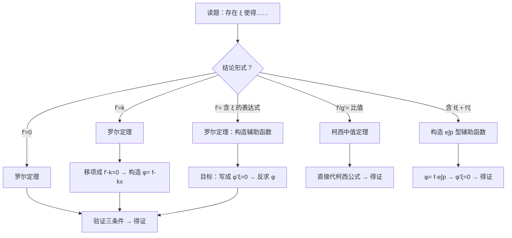

# 题型1：中值定理证明题

## 识别特征

1. 题干出现「存在 $\xi \in (a,b)$，使得……」
2. 题干给出 $f(x)$ 的连续性、可导性条件 + 端点值信息
3. 结论中含有 $f(\xi), f'(\xi), f''(\xi)$ 及其组合

## 解题流程

## 通法步骤

### 步骤1：定型 — 判定使用哪个中值定理

| 结论特征 | 使用的定理 | 标志 |
|---------|-----------|------|
| $f'(\xi) = 0$ | 罗尔定理 | 最简单形式 |
| $f'(\xi) = k$（常数） | 罗尔（辅助函数 $f-kx$） | 右端为常数 |
| $f'(\xi) = g(\xi)$（含 $\xi$） | 罗尔（辅助函数 $f - G$，$G'=g$） | 右端含 $\xi$ |
| $\frac{f(b)-f(a)}{g(b)-g(a)} = \frac{f'(\xi)}{g'(\xi)}$ | 柯西中值定理 | 两函数比值 |
| $f'(\xi) + p(\xi)f(\xi) = 0$ | 罗尔（辅助函数 $f e^{\int p}$） | 一阶线性微分型 |

### 步骤2：构造辅助函数 $\varphi(x)$

**核心原则**：将被证等式写成 $\varphi'(\xi) = 0$ 的形式，反求 $\varphi(x)$

**常见构造速查**：

| 被证等式 | 辅助函数 $\varphi(x)$ |
|---------|---------------------|
| $f'(\xi) = 0$ | $f(x)$ |
| $f'(\xi) = k$ | $f(x) - kx$ |
| $f'(\xi) = 2\xi$ | $f(x) - x^2$ |
| $f'(\xi) + f(\xi) = 0$ | $f(x) e^x$ |
| $f'(\xi) - f(\xi) = 0$ | $f(x) e^{-x}$ |
| $\xi f'(\xi) + f(\xi) = 0$ | $x f(x)$ |
| $\xi f'(\xi) - f(\xi) = 0$ | $\frac{f(x)}{x}$ |
| $f'(\xi) + \lambda f(\xi) = 0$ | $f(x) e^{\lambda x}$ |
| $f'(\xi) + p(\xi) f(\xi) = 0$ | $f(x) e^{\int p(x)dx}$ |

### 步骤3：验证条件并应用定理

1. 验证 $\varphi(x)$ 在 $[a,b]$ 上连续
2. 验证 $\varphi(x)$ 在 $(a,b)$ 内可导
3. 验证 $\varphi(a) = \varphi(b)$（罗尔定理）或直接应用柯西公式
4. 由定理得 $\varphi'(\xi) = 0$ → 整理得原结论

## 常见陷阱

| # | 陷阱 | 避坑方法 |
|---|------|---------|
| 1 | 不验证三条件直接套罗尔定理 | 必须逐一验证：连续性、可导性、端点值相等 |
| 2 | 辅助函数符号搞反 | 口诀：$\varphi' = \text{被证等式的左端}$，积分反推 $\varphi$ |
| 3 | 需要二次使用中值定理时忘记第一步 | 需要证明 $f''(\xi) = 0$ 时，先对 $f$ 用两次罗尔或对 $f'$ 用一次罗尔 |
| 4 | 结论含 $\xi$ 但不在分母位置时误用柯西 | 柯西的特征是 **两函数差值之比**，含 $\xi$ 在分子分母同现 |

## 经典母题

### 母题 1（罗尔定理 + 构造函数）

> 设 $f(x)$ 在 $[0,1]$ 上连续，$(0,1)$ 内可导，$f(0)=0$，$f(1)=1$。证明：$\exists \xi \in (0,1)$，使得 $f'(\xi) = 2\xi$。

**解**：构造 $\varphi(x) = f(x) - x^2$

$\varphi(0) = 0 - 0 = 0$，$\varphi(1) = 1 - 1 = 0$ → $\varphi(0) = \varphi(1)$

$\varphi \in C[0,1] \cap D(0,1)$，由罗尔定理 $\exists \xi \in (0,1)$，$\varphi'(\xi) = 0$

$\varphi'(x) = f'(x) - 2x$，故 $f'(\xi) - 2\xi = 0 \Rightarrow f'(\xi) = 2\xi$。

### 母题 2（含 $f$ 和 $f'$ 的微分型）

> 设 $f(x)$ 在 $[0,1]$ 上连续，$(0,1)$ 内可导，$f(0) = f(1) = 0$。证明：$\exists \xi \in (0,1)$，使得 $f'(\xi) + f(\xi) = 0$。

**解**：构造 $\varphi(x) = f(x) e^x$

$\varphi(0) = f(0) \cdot 1 = 0$，$\varphi(1) = f(1) \cdot e = 0$ → $\varphi(0) = \varphi(1)$

由罗尔定理 $\exists \xi \in (0,1)$，$\varphi'(\xi) = 0$

$\varphi'(x) = f'(x) e^x + f(x) e^x = e^x[f'(x) + f(x)]$

$e^\xi \neq 0$，故 $f'(\xi) + f(\xi) = 0$。

### 母题 3（柯西中值定理）

> 设 $f(x), g(x)$ 在 $[a,b]$ 上连续，$(a,b)$ 内可导，$g'(x) \neq 0$。证明：$\exists \xi \in (a,b)$，使得 $\frac{f(b)-f(a)}{g(b)-g(a)} = \frac{f'(\xi)}{g'(\xi)}$。

**解**：这是柯西中值定理的标准形式，直接套用即可。

验证 $g(b) \neq g(a)$（由 $g'(x) \neq 0$ 及拉格朗日中值定理可保），其他条件原文已给，直接由柯西中值定理得证。
