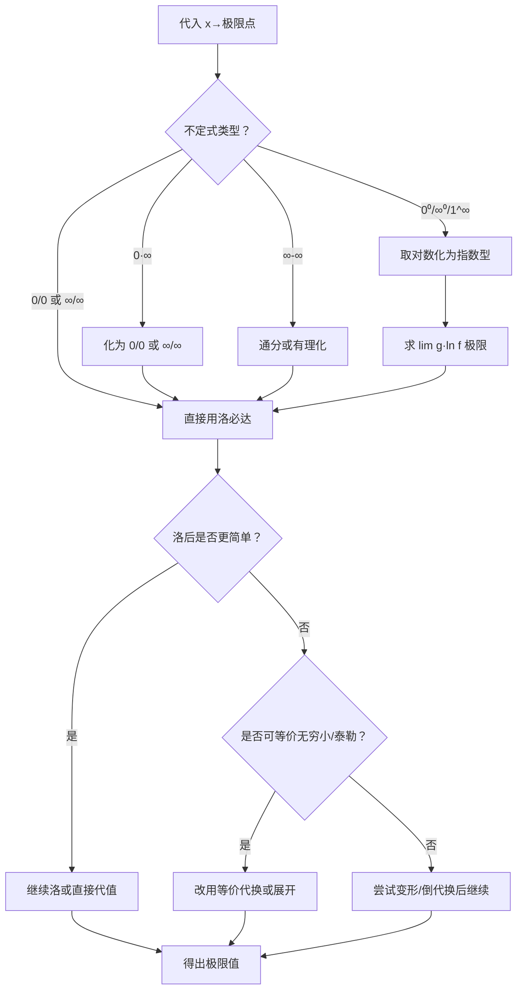

# 题型2：洛必达法则求极限

## 识别特征

1. 极限表达式代入后出现 $\frac{0}{0}$ 或 $\frac{\infty}{\infty}$ 型
2. 分子分母均可导（至少在去心邻域内）
3. 极限式中含有变限积分、复杂分式、幂指函数等

## 解题流程

## 通法步骤

### 步骤1：验证不定式

代入极限点，确认是 $\frac{0}{0}$ 或 $\frac{\infty}{\infty}$ 型。非不定式不能洛必达。

### 步骤2：化简（洛前准备）

- **等价无穷小替换**（乘除因子可直接替换，加减因子不可随意替换）
- *常用等价无穷小（$x \to 0$）*：
  $\sin x \sim x$, $\tan x \sim x$, $\arcsin x \sim x$, $\arctan x \sim x$
  $\ln(1+x) \sim x$, $e^x - 1 \sim x$, $1 - \cos x \sim \frac{x^2}{2}$
  $(1+x)^\alpha - 1 \sim \alpha x$

### 步骤3：应用洛必达

$$\lim \frac{f(x)}{g(x)} = \lim \frac{f'(x)}{g'(x)}$$

若一次洛后仍为不定式，可继续洛，但每次都要验证是否仍为 $\frac{0}{0}$ 或 $\frac{\infty}{\infty}$。

### 步骤4：各不定式转化方法

| 原类型 | 转化方法 | 示例 |
|--------|---------|------|
| $0 \cdot \infty$ | $f \cdot g = \frac{f}{1/g} = \frac{g}{1/f}$ | $x\ln x = \frac{\ln x}{1/x}$ |
| $\infty - \infty$ | 通分：$\frac{1}{f} - \frac{1}{g} = \frac{g-f}{fg}$ | $\frac{1}{\ln x} - \frac{1}{x-1}$ |
| $0^0, \infty^0$ | $f^g = e^{g\ln f}$ → 求 $\lim g\ln f$ | $x^x$ |
| $1^\infty$ | 公式：$\lim f^g = e^{\lim g(f-1)}$ | $(1+\frac{1}{n})^n$ |

## 常见陷阱

| # | 陷阱 | 避坑方法 |
|---|------|---------|
| 1 | 非不定式误用洛必达 | 代入验证！非 0/0 或 ∞/∞ 不能用 |
| 2 | 洛必达失败 → 认为极限不存在 | $\lim \frac{f'}{g'}$ 振荡不存在 $\not\Rightarrow$ $\lim \frac{f}{g}$ 不存在 |
| 3 | 无限循环洛必达 | $e^x/x^n$ 型越洛越复杂 → 直接用"指数 > 幂函数"结论 |
| 4 | 加减因子内随意等价替换 | 加减因子内部不能直接用等价无穷小替换！$\sin x - \tan x \neq x - x$ |

## 经典母题

### 母题 1（$\frac{0}{0}$ 型 + 等价无穷小配合）

> 求 $\displaystyle \lim_{x \to 0} \frac{\tan x - \sin x}{x^3}$

**解**：先变形：$\tan x - \sin x = \tan x(1 - \cos x) \sim x \cdot \frac{x^2}{2} = \frac{x^3}{2}$

故原式 $= \lim\limits_{x \to 0} \frac{x^3/2}{x^3} = \frac{1}{2}$

> 用洛必达验证（三步）：洛一次 → $\frac{\sec^2 x - \cos x}{3x^2}$，洛二次 → $\frac{2\sec^2 x\tan x + \sin x}{6x} \to \frac{1}{2}$

### 母题 2（$1^\infty$ 型）

> 求 $\displaystyle \lim_{x \to 0} (\cos x)^{\frac{1}{x^2}}$

**解**：$1^\infty$ 型。$\lim\limits_{x \to 0} \frac{\ln \cos x}{x^2}$

用洛必达：$\lim\limits_{x \to 0} \frac{-\tan x}{2x} = \lim\limits_{x \to 0} \frac{-x}{2x} = -\frac{1}{2}$

故原式 $= e^{-1/2}$

> 快捷法：$\cos x \sim 1 - \frac{x^2}{2}$，$(\cos x)^{1/x^2} \sim (1 - \frac{x^2}{2})^{1/x^2} \to e^{-1/2}$

### 母题 3（$\infty - \infty$ 型）

> 求 $\displaystyle \lim_{x \to 1} \left( \frac{1}{\ln x} - \frac{1}{x-1} \right)$

**解**：通分：$\lim\limits_{x \to 1} \frac{x-1 - \ln x}{(x-1)\ln x}$

$x \to 1$ 时为 $\frac{0}{0}$，洛必达：

$\lim\limits_{x \to 1} \frac{1 - \frac{1}{x}}{\ln x + \frac{x-1}{x}} = \lim\limits_{x \to 1} \frac{\frac{x-1}{x}}{\frac{x\ln x + x-1}{x}} = \lim\limits_{x \to 1} \frac{x-1}{x\ln x + x-1}$

再洛一次（仍为 $\frac{0}{0}$）：$\lim\limits_{x \to 1} \frac{1}{\ln x + 1 + 1} = \frac{1}{2}$
