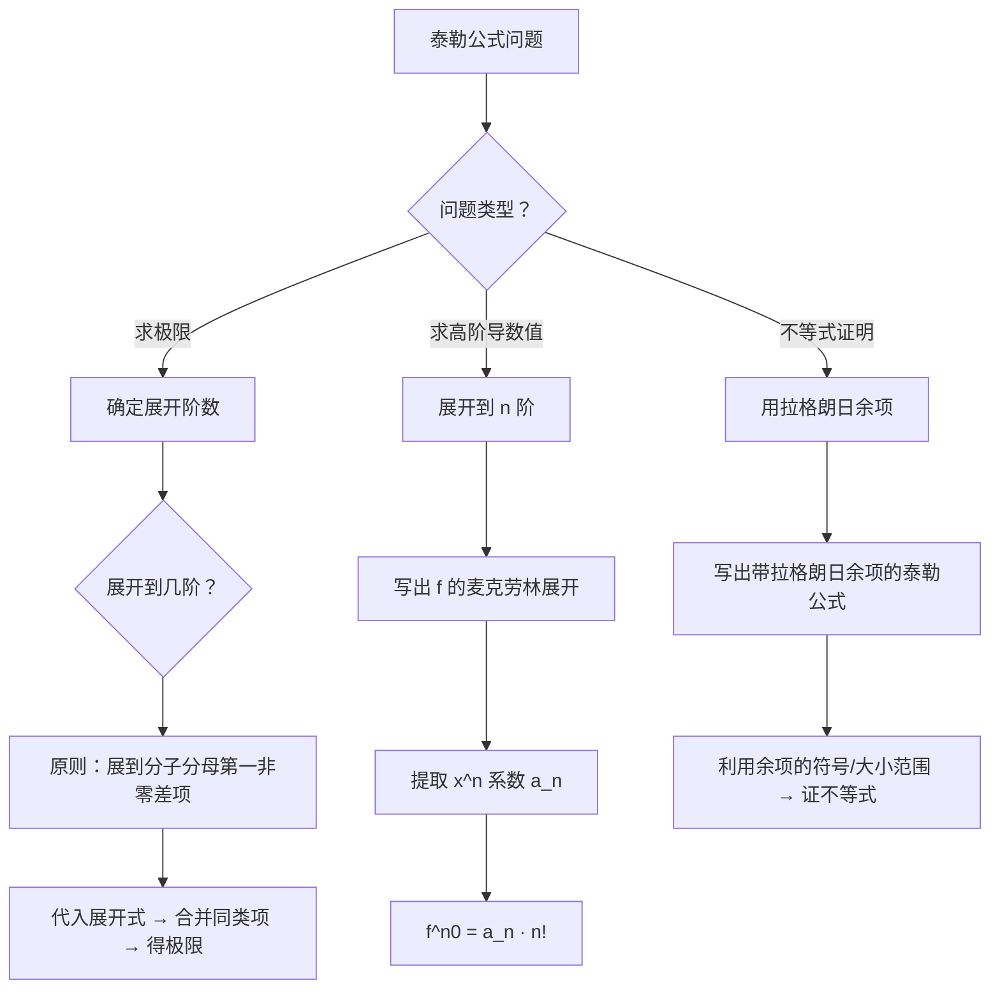

# 题型3：泰勒公式的应用

## 识别特征

1. 极限式中分子分母含 $\sin x, \cos x, e^x, \ln(1+x)$ 的组合
2. 题干要求「求 $f^{(n)}(0)$」
3. 不等式证明中需要精度高于中值定理的情况
4. 当洛必达法则过于繁琐或失效时

## 解题流程

## 通法步骤

### 一、极限计算中的应用

**步骤**：
1. 确定展开到几阶：观看分母中 $x$ 的最高次幂（或预期分子消去后的首项）
2. 展开分子中每个函数到所需阶数
3. 代入并合并同类项
4. 化简得极限

**展开阶数原则**：**「展到第一非零差项出现」** — 宁可多展一项也不要少展

### 二、高阶导数值的计算

**核心公式**：$f^{(n)}(0) = a_n \cdot n!$，其中 $a_n = \frac{f^{(n)}(0)}{n!}$ 是麦克劳林展开中 $x^n$ 的系数。

**步骤**：
1. 用已知展开式 + 加减乘除得到 $f(x)$ 的麦克劳林展开
2. 读出 $x^n$ 项系数 $a_n$
3. 代入公式得 $f^{(n)}(0)$

### 三、不等式证明中的应用

**步骤**：
1. 选择展开中心 $x_0$（通常选 0 或区间中点）
2. 写出带拉格朗日余项的 $n$ 阶泰勒公式
3. 利用余项中 $\xi$ 的范围（$\xi$ 在 $x_0$ 与 $x$ 之间）确定余项符号或上界
4. 由泰勒等式推导不等式

## 必背展开式速查

| $f(x)$ | 麦克劳林展开（到 $x^5$） | 通项系数 |
|--------|----------------------|---------|
| $e^x$ | $1+x+\frac{x^2}{2!}+\frac{x^3}{3!}+\frac{x^4}{4!}+\frac{x^5}{5!}+o(x^5)$ | $\frac{1}{k!}$ |
| $\sin x$ | $x-\frac{x^3}{3!}+\frac{x^5}{5!}+o(x^5)$ | $\frac{(-1)^k}{(2k+1)!}$（奇次） |
| $\cos x$ | $1-\frac{x^2}{2!}+\frac{x^4}{4!}+o(x^5)$ | $\frac{(-1)^k}{(2k)!}$（偶次） |
| $\ln(1+x)$ | $x-\frac{x^2}{2}+\frac{x^3}{3}-\frac{x^4}{4}+\frac{x^5}{5}+o(x^5)$ | $\frac{(-1)^{k-1}}{k}$ |
| $(1+x)^\alpha$ | $1+\alpha x+\frac{\alpha(\alpha-1)}{2!}x^2+\cdots$ | 广义二项式系数 |
| $\arctan x$ | $x-\frac{x^3}{3}+\frac{x^5}{5}+o(x^5)$ | $\frac{(-1)^k}{2k+1}$（奇次，分母无阶乘） |

**记忆技巧**：
- $e^x$：全正全阶乘 → 「饿死（$e^x$）还有阶乘吃」
- $\sin x / \cos x$：交错符号 + 阶乘 → $\sin$ 奇次，$\cos$ 偶次
- $\ln(1+x)$：无阶乘分母 → 「$\ln$ 没有阶乘命」
- $\arctan x$：无阶乘 + 奇次 → 和 $\sin x$ 相似但分母无阶乘

## 常见陷阱

| # | 陷阱 | 避坑方法 |
|---|------|---------|
| 1 | 展开阶数不够，关键项被消 | 展开到 $x^n$ 后检查是否有同类项抵消，如有则需多展一项 |
| 2 | 加减法中渗入等价无穷小 | 加减因子运算不能用等价无穷小替换，必须用泰勒展开！ |
| 3 | 忘记 $o(x^n)$ 的运算规则 | $o(x^n) \pm o(x^n) = o(x^n)$，$x^m \cdot o(x^n) = o(x^{m+n})$ |
| 4 | 混淆皮亚诺余项与拉格朗日余项的使用场景 | 极限 → 皮亚诺（定性）；不等式/误差 → 拉格朗日（定量） |

## 经典母题

### 母题 1（极限 + 泰勒）

> 求 $\displaystyle \lim_{x \to 0} \frac{e^x - \sin x - \cos x}{x^2}$

**解**：展开到 $x^2$ 阶（分母 $x^2$）。

$e^x = 1 + x + \frac{x^2}{2} + o(x^2)$

$\sin x = x + o(x^2)$

$\cos x = 1 - \frac{x^2}{2} + o(x^2)$

分子：$(1+x+\frac{x^2}{2}) - x - (1-\frac{x^2}{2}) + o(x^2) = x^2 + o(x^2)$

极限 $= \lim\limits_{x \to 0} \frac{x^2 + o(x^2)}{x^2} = 1$

### 母题 2（高阶导数值）

> 求 $f(x) = x^2 \sin x$ 在 $x=0$ 处的 $f^{(10)}(0)$。

**解**：$\sin x = x - \frac{x^3}{6} + \frac{x^5}{120} - \frac{x^7}{5040} + \frac{x^9}{362880} + \cdots$

$f(x) = x^2 \sin x = x^3 - \frac{x^5}{6} + \frac{x^7}{120} - \frac{x^9}{5040} + \frac{x^{11}}{362880} + \cdots$

展开式中全是奇次项（$x^3, x^5, x^7, x^9, x^{11}, \ldots$），没有 $x^{10}$ 项 → $a_{10} = 0$

故 $f^{(10)}(0) = 0 \cdot 10! = 0$
