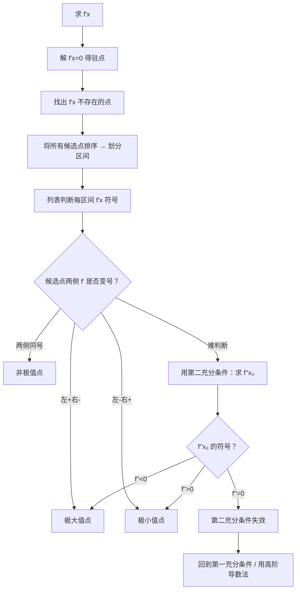

# 题型4：单调性与极值判定

## 识别特征

1. 题干给出 $f'(x)$ 的表达式或图像，问 $f(x)$ 的单调区间
2. 题干要求判定极值点、极值
3. 求导后有明确的因式分解形式可做符号分析

## 解题流程

## 通法步骤

### 极值判定的完整流程

1. **求导**：求出 $f'(x)$
2. **找候选点**：解 $f'(x)=0$ 得驻点 $+$ 找出 $f'(x)$ 不存在的点
3. **排序**：将所有候选点从小到大排列，划分出区间
4. **判符号**：在每个区间内取测试点，确定 $f'$ 的正负
5. **判极值**：
   - $f'$ 左正右负 → **极大值**
   - $f'$ 左负右正 → **极小值**
   - $f'$ 两侧同号 → 非极值

### 第二充分条件的使用条件

**仅在 $f'(x_0)=0$ 时可用**：
- $f''(x_0) > 0$ → 极小值
- $f''(x_0) < 0$ → 极大值
- $f''(x_0) = 0$ → 第二充分条件失效，用第一充分条件

### 高阶导数判定法（第三充分条件）

若 $f'(x_0) = f''(x_0) = \cdots = f^{(n-1)}(x_0) = 0$，$f^{(n)}(x_0) \neq 0$：
- $n$ **为偶数** → $x_0$ 是极值点（$f^{(n)}>0$ 极小，$f^{(n)}<0$ 极大）
- $n$ **为奇数** → $x_0$ 不是极值点

## 常见陷阱

| # | 陷阱 | 避坑方法 |
|---|------|---------|
| 1 | 看到 $f'(x_0)=0$ 就断定是极值 | $f'(x_0)=0$ 是必要条件不是充分条件！必须验证 $f'$ 变号 |
| 2 | 遗漏不可导候选点 | 极值点也可能在不可导点处取得（$f(x)=|x|$ 在 $x=0$） |
| 3 | 第二充分条件在 $f''(x_0)=0$ 时继续使用 | $f''(x_0)=0$ 时该方法失效，改用第一充分条件 |
| 4 | 极值 vs 最值概念混淆 | 极值是局部概念，最值是全局概念 |

## 经典母题

### 母题 1（标准极值判定）

> 求 $f(x) = x^3 - 3x$ 的单调区间和极值。

**解**：$f'(x) = 3x^2 - 3 = 3(x-1)(x+1)$

驻点：$x = -1, 1$

| 区间 | $(-\infty, -1)$ | $(-1, 1)$ | $(1, +\infty)$ |
|------|----------------|-----------|----------------|
| $f'$ 符号 | $+$ | $-$ | $+$ |
| $f$ 单调性 | 递增 | 递减 | 递增 |

$f'$ 在 $x=-1$ 处左正右负 → $x=-1$ 为极大值点，极大值 $f(-1)=2$

$f'$ 在 $x=1$ 处左负右正 → $x=1$ 为极小值点，极小值 $f(1)=-2$

### 母题 2（第二充分条件）

> 求 $f(x) = x^4 - 2x^2$ 的极值。

**解**：$f'(x) = 4x^3 - 4x = 4x(x-1)(x+1)$，驻点 $x=-1,0,1$

$f''(x) = 12x^2 - 4$

$x=-1$：$f''(-1) = 8 > 0$ → 极小值 $f(-1) = -1$

$x=0$：$f''(0) = -4 < 0$ → 极大值 $f(0) = 0$

$x=1$：$f''(1) = 8 > 0$ → 极小值 $f(1) = -1$

### 母题 3（不可导点的极值）

> 求 $f(x) = |x(x-2)|$ 在 $[-1,3]$ 上的极值。

**解**：分段分析。$f'(x)$ 在 $x=0$ 和 $x=2$ 处不存在（尖点）。

- $x=0$：左负右正 $\to$ 极小值 $f(0)=0$
- $x=2$：左正右负 $\to$ 极大值 $f(2)=0$
