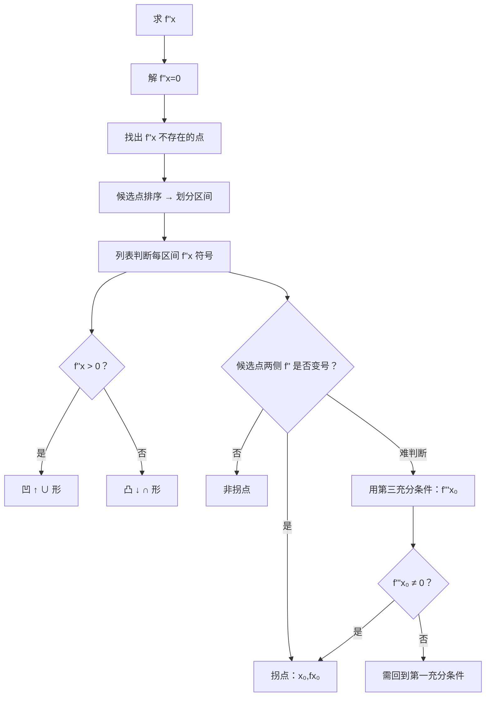

# 题型5：凹凸性与拐点

## 识别特征

1. 题干给出 $f''(x)$ 的符号/表达式/图像信息
2. 要求判定曲线的凹凸区间和拐点
3. 题干中出现「凹凸性」「拐点」「上凹/下凹」等关键词

## 解题流程

## 通法步骤

### 拐点判定的完整流程

1. **求二阶导**：求出 $f''(x)$
2. **找候选点**：解 $f''(x)=0$ + 找出 $f''(x)$ 不存在的点
3. **排序划分区间**：将所有候选点排序，划分区间
4. **判凹凸性**：在每个区间测试 $f''(x)$ 的正负
   - $f''(x) > 0$ → 凹（$\cup$ 形）
   - $f''(x) < 0$ → 凸（$\cap$ 形）
5. **判拐点**：$f''$ 在候选点两侧**变号** → 该点是拐点；两侧同号 → 非拐点

### 拐点的充分条件

| 方法 | 条件 | 结论 |
|------|------|------|
| 第一充分条件 | $f''(x_0)=0$（或不存在），且 $f''$ 在 $x_0$ 两侧变号 | $(x_0, f(x_0))$ 是拐点 |
| 第三充分条件 | $f''(x_0)=0$ 且 $f'''(x_0) \neq 0$ | $(x_0, f(x_0))$ 是拐点 |

### ⚠️ 关键区分

| 判定对象 | 看谁的符号 | 符号变化 → | 答案形式 |
|---------|----------|-----------|---------|
| 单调性/极值 | $f'$ | $f'$ 变号 → 极值点 | 极值 = 数值 $f(x_0)$ |
| 凹凸性/拐点 | $f''$ | $f''$ 变号 → 拐点 | 拐点 = 坐标 $(x_0, f(x_0))$ |

## 常见陷阱

| # | 陷阱 | 避坑方法 |
|---|------|---------|
| 1 | 拐点答案只写 $x$ 坐标 | 拐点是曲线上的点，必须写成 $(x_0, f(x_0))$ |
| 2 | $f''(x_0)=0$ 就断定是拐点 | 必要条件非充分条件，必须验证 $f''$ 变号 |
| 3 | 遗漏 $f''(x)$ 不存在的候选点 | $f(x)=x^{1/3}$ 在 $x=0$ 处 $f''$ 不存在，但 $(0,0)$ 是拐点 |
| 4 | 混淆极值点和拐点的判定方法 | 极值看 $f'$ 变号；拐点看 $f''$ 变号 — 不要交叉使用 |

## 经典母题

### 母题 1（标准拐点判定）

> 求 $f(x) = x^4 - 6x^2$ 的凹凸区间和拐点。

**解**：$f'(x) = 4x^3 - 12x$，$f''(x) = 12x^2 - 12 = 12(x-1)(x+1)$

$f''(x)=0$ 得 $x = \pm 1$

| 区间 | $(-\infty, -1)$ | $(-1, 1)$ | $(1, +\infty)$ |
|------|----------------|-----------|----------------|
| $f''$ 符号 | $+$ | $-$ | $+$ |
| 凹凸性 | 凹 $\cup$ | 凸 $\cap$ | 凹 $\cup$ |

$f''$ 在 $x=-1$ 两侧变号 → $(-1, f(-1)) = (-1, -5)$ 是拐点

$f''$ 在 $x=1$ 两侧变号 → $(1, f(1)) = (1, -5)$ 是拐点

### 母题 2（$f''$ 不存在的拐点）

> 求 $f(x) = \sqrt[3]{x}$ 的拐点。

**解**：$f'(x) = \frac{1}{3}x^{-2/3}$，$f''(x) = -\frac{2}{9}x^{-5/3}$

$f''(x) \neq 0$（恒不为零），但 $f''(x)$ 在 $x=0$ 处不存在。

$x<0$：$f''(x) = -\frac{2}{9} \cdot (负) > 0$ → 凹

$x>0$：$f''(x) < 0$ → 凸

$f''$ 在 $x=0$ 两侧变号 → $(0, 0)$ 是拐点。

### 母题 3（$f''(x_0)=0$ 但非拐点的反例）

> 判断 $f(x) = x^4$ 在 $x=0$ 处是否有拐点。

**解**：$f''(x) = 12x^2$，$f''(0) = 0$。

但 $x<0$ 时 $f'' > 0$，$x>0$ 时 $f'' > 0$，两侧符号相同 → $(0,0)$ **不是**拐点。
