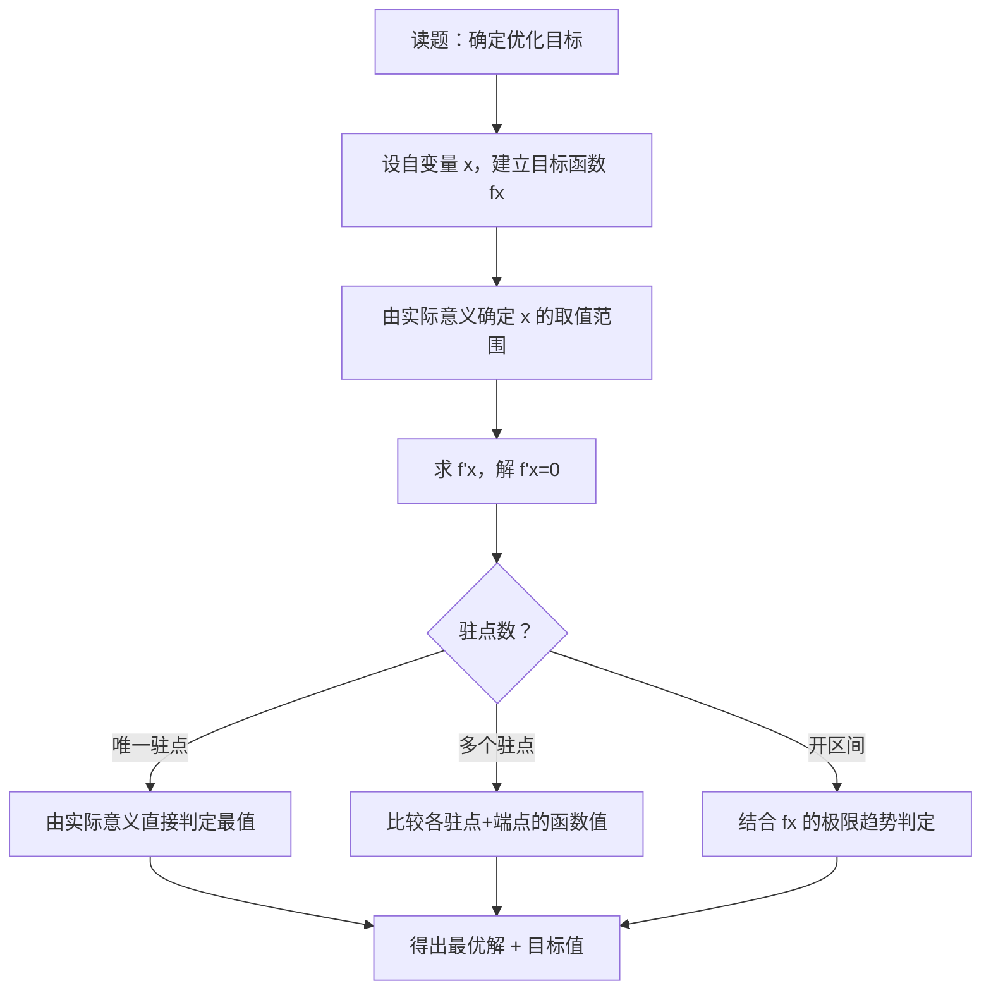

# 题型6：最值应用题

## 识别特征

1. 题干出现「最大」「最小」「最省」「最优」等字眼
2. 问题涉及几何图形的最优尺寸、物理量的极值
3. 含实际背景：用料最省、体积最大、距离最短等

## 解题流程

## 通法步骤

### 闭区间上连续函数的最值求法

1. 求 $f'(x)$，解 $f'(x)=0$ 得驻点
2. 找出 $f'(x)$ 不存在的点
3. 计算所有候选点及区间端点处的函数值
4. 比较 → 最大/最小值

- *极简例子：* $f(x) = x^3 - 3x$ 在 $[-2, 2]$ 上：$f(-2)=-2$，$f(-1)=2$，$f(1)=-2$，$f(2)=2$ → $\max = 2$，$\min = -2$

### 开区间/无穷区间的最值

若 $\lim_{x \to a^+} f(x) = \lim_{x \to b^-} f(x) = +\infty$，则 $f(x)$ 在 $(a,b)$ 内必有最小值。

- 思路：用单调性画粗略图像 $\to$ 确定最值位置
- 若 $f$ 先减后增（$f'$ 由负变正）→ 存在最小值
- 若 $f$ 先增后减（$f'$ 由正变负）→ 存在最大值

### 实际应用题的最值 ⭐

1. **建模**：设变量 $x$，建立目标函数 $f(x)$
2. **定域**：根据实际意义确定 $x$ 的定义域
3. **求导**：求 $f'(x)$，解驻点
4. **判定**（唯一驻点策略）：若实际问题显然存在最值，且 $f'(x)=0$ 在定义域内只有一个解，则该驻点必为所求最值点（**无需验证二阶导数**）
5. **回答**：给出最优方案和对应的最优值

## 常见陷阱

| # | 陷阱 | 避坑方法 |
|---|------|---------|
| 1 | 闭区间最值忘记比端点 | 闭区间最值 = $\max\{候选点值, 端点值\}$，端点必须参与比较 |
| 2 | 开区间直接断言最值存在 | 开区间最值不一定存在，需借助单调性和极限趋势判断 |
| 3 | 实际应用题的目标函数定义域搞错 | 仔细分析变量的实际约束（边长$>0$、角度范围等） |
| 4 | 唯一驻点就直接写答案不加说明 | 必须说明「由实际问题知最值存在，且驻点唯一，故即为所求」 |

## 经典母题

### 母题 1（几何最值）

> 周长为 $2p$ 的矩形，何时面积最大？最大面积是多少？

**解**：设矩形长为 $x$，则宽为 $p-x$，$x \in (0, p)$

面积 $S(x) = x(p-x) = px - x^2$

$S'(x) = p - 2x = 0 \Rightarrow x = \frac{p}{2}$（唯一驻点）

$S''(x) = -2 < 0$ → $x = \frac{p}{2}$ 时 $S$ 取最大值

此时宽 $= p - \frac{p}{2} = \frac{p}{2} = x$ → **正方形**，最大面积 $= \frac{p^2}{4}$

### 母题 2（距离最值）

> 求点 $(1, 4)$ 到抛物线 $y^2 = 2x$ 上点的最短距离。

**解**：设抛物线上一点为 $(\frac{y^2}{2}, y)$

距离平方 $d^2(y) = (\frac{y^2}{2} - 1)^2 + (y - 4)^2$

求导：$(d^2)' = 2(\frac{y^2}{2} - 1) \cdot y + 2(y - 4) = y^3 - 2y + 2y - 8 = y^3 - 8$

令 $(d^2)' = 0$ 得 $y^3 = 8 \Rightarrow y = 2$（唯一驻点）

由实际意义最短距离存在 → $y=2$ 即为所求，对应点 $(2, 2)$，最短距离 $= \sqrt{(2-1)^2 + (2-4)^2} = \sqrt{5}$

### 母题 3（闭区间最值）

> 求 $f(x) = x + \sqrt{1-x^2}$ 在 $[-1, 1]$ 上的最值。

**解**：$f'(x) = 1 - \frac{x}{\sqrt{1-x^2}} = \frac{\sqrt{1-x^2} - x}{\sqrt{1-x^2}}$

令 $f'(x)=0$：$\sqrt{1-x^2} = x \Rightarrow 1-x^2 = x^2 \Rightarrow x = \frac{1}{\sqrt{2}}$（唯一驻点）

比较候选值和端点：

$f(-1) = -1 + 0 = -1$

$f(1/\sqrt{2}) = \frac{1}{\sqrt{2}} + \frac{1}{\sqrt{2}} = \sqrt{2}$

$f(1) = 1 + 0 = 1$

最大值 $= \sqrt{2}$，最小值 $= -1$
