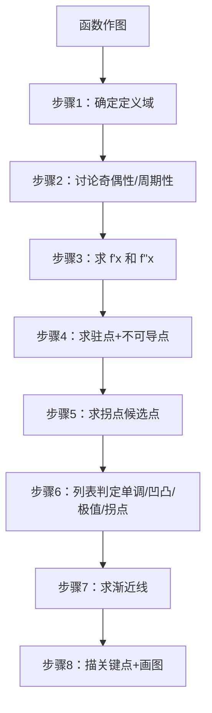

# 题型7：函数作图与渐近线

## 识别特征

1. 题干要求「描绘函数 $y=f(x)$ 的图形」
2. 题干要求「求曲线所有的渐近线」
3. 题干是「已知 $y'$ 和 $y''$ 的符号表，推断函数形状」

## 解题流程

## 通法步骤

### 渐近线求法（最常考的独立小题）

#### 1. 水平渐近线
$$\lim_{x \to +\infty} f(x) = A \quad \text{或} \quad \lim_{x \to -\infty} f(x) = B \quad \Rightarrow \quad y = A \text{ 或 } y = B$$

- $+\infty$ 和 $-\infty$ 可能给出**不同**的水平渐近线
- *极简例子：* $y=\arctan x$，$x\to+\infty$ 时 $y\to\frac{\pi}{2}$，$x\to-\infty$ 时 $y\to-\frac{\pi}{2}$（两条水平渐近线）

#### 2. 垂直渐近线（铅直渐近线）
$$\lim_{x \to a^{\pm}} f(x) = \infty \quad \Rightarrow \quad x = a$$

- $a$ 通常是分母为零的点或无定义点
- $a$ 两侧极限可能一个趋于 $+\infty$、一个趋于 $-\infty$
- *极简例子：* $y=\frac{1}{x-1}$，$\lim_{x\to 1} y = \infty$ $\to$ $x=1$ 是垂直渐近线

#### 3. 斜渐近线

若 $\lim_{x \to \pm\infty} f(x) = \infty$（无水平渐近线时），则求：

$$k = \lim_{x \to \pm\infty} \frac{f(x)}{x} \quad (k \neq 0, k \neq \infty)$$

$$b = \lim_{x \to \pm\infty} [f(x) - kx]$$

得到 $y = kx + b$

- **注意**：同一方向上，水平渐近线与斜渐近线不会同时存在。求出水平（$k=0$）就不需要再求斜的。
- $+\infty$ 和 $-\infty$ 可能给出**不同**的斜渐近线

### 作图的三行判定表

| 列 | $x$ | $(-\infty, x_1)$ | $x_1$ | $(x_1, x_2)$ | $x_2$ | $(x_2, +\infty)$ |
|----|-----|-----------------|-------|-------------|-------|-----------------|
| 行1 | $f'$ | 符号 | 0/不存在 | 符号 | ... | 符号 |
| 行2 | $f$ | 单调性 | 极值 | 单调性 | ... | 单调性 |
| 行3 | $f''$ | 符号 | — | 符号 | 0/不存在 | 符号 |
| 行4 | 凹凸性 | 凹凸 | — | 凹凸 | 拐点 | 凹凸 |

## 常见陷阱

| # | 陷阱 | 避坑方法 |
|---|------|---------|
| 1 | 水平渐近线和斜渐近线在同一方向重复求 | 同一方向（$+\infty$ 或 $-\infty$）二者不会共存，求出水平就不要求斜的 |
| 2 | 只求 $x\to+\infty$ 的渐近线 | $+\infty$ 和 $-\infty$ 两个方向分别求，可能不同 |
| 3 | 垂直渐近线漏掉单侧趋于无穷的情况 | 对每个无定义点分别求左右极限 |
| 4 | 忘记找斜渐近线的 $b$ | 求出 $k$ 后必须再求 $b$，否则渐近线方程不完整 |

## 经典母题

### 母题 1（渐近线完整求解）

> 求 $y = \frac{x^2 + 2x + 3}{x-1}$ 的所有渐近线。

**解**：

**垂直渐近线**：$x=1$ 时分母为零。

$\lim_{x \to 1^+} y = +\infty$，$\lim_{x \to 1^-} y = -\infty$ → $x=1$ 是垂直渐近线。

**水平/斜渐近线**：

先看 $x \to +\infty$：$\lim_{x \to +\infty} y = \infty$（无水平），求斜的。

$k = \lim_{x \to +\infty} \frac{x^2+2x+3}{x(x-1)} = \lim_{x \to +\infty} \frac{x^2+2x+3}{x^2-x} = 1$

$b = \lim_{x \to +\infty} \left[ \frac{x^2+2x+3}{x-1} - x \right] = \lim_{x \to +\infty} \frac{x^2+2x+3 - x^2 + x}{x-1} = \lim_{x \to +\infty} \frac{3x+3}{x-1} = 3$

$x \to -\infty$ 时同理 → $k=1, b=3$（相同）

斜渐近线：$y = x + 3$

**答案**：垂直渐近线 $x=1$，斜渐近线 $y=x+3$

### 母题 2（两方向不同渐近线）

> 求 $y = x e^{1/x}$ 的渐近线。

**解**：$\lim_{x \to 0^+} x e^{1/x} = +\infty$，$\lim_{x \to 0^-} x e^{1/x} = 0$（注意！$x \to 0^-$ 时 $e^{1/x} \to 0$）

→ 仅有右极限趋于无穷，$x=0$ 不是双侧垂直渐近线但有单侧。

$x \to +\infty$：$k = \lim_{x \to \infty} \frac{x e^{1/x}}{x} = 1$，$b = \lim_{x \to \infty} (x e^{1/x} - x) = \lim_{x \to \infty} x(e^{1/x} - 1) = 1$

斜渐近线：$y = x + 1$

$x \to -\infty$ 同理可得 $y = x + 1$
