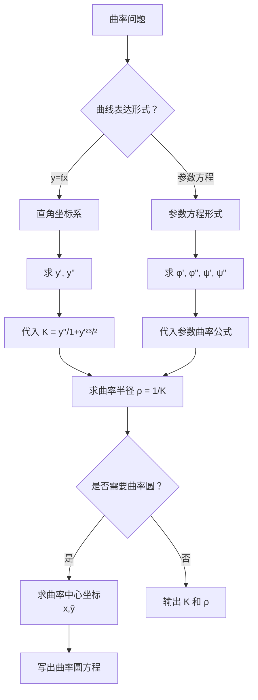

# 题型8：曲率计算

## 识别特征

1. 题干出现「曲率」「曲率半径」「曲率圆」「曲率中心」等关键词
2. 给了曲线方程，要求在某点的曲率或曲率圆方程
3. 几何/物理应用：弯曲程度、最小曲率半径等

## 解题流程

## 通法步骤

### 一、曲率的基本计算

**直角坐标系** $y = f(x)$：

$$K = \frac{|y''|}{(1 + y'^2)^{3/2}}$$

**参数方程** $\begin{cases} x = \varphi(t) \\ y = \psi(t) \end{cases}$：

$$K = \frac{|\varphi'(t)\psi''(t) - \varphi''(t)\psi'(t)|}{[(\varphi'(t))^2 + (\psi'(t))^2]^{3/2}}$$

**曲率半径**：$\rho = \frac{1}{K}$

### 二、曲率圆（密切圆）

曲率中心 $(\bar{x}, \bar{y})$：

$$\bar{x} = x - \frac{y'(1 + y'^2)}{y''}, \qquad \bar{y} = y + \frac{1 + y'^2}{y''}$$

曲率圆方程：$(X - \bar{x})^2 + (Y - \bar{y})^2 = \rho^2$

### 三、弧微分

$$ds = \sqrt{1 + (y')^2}\,dx$$
$$ds = \sqrt{(dx/dt)^2 + (dy/dt)^2}\,dt \quad \text{（参数方程）}$$

### 四、曲率公式的记忆技巧

- 分子 $\to$ $|y''|$（二阶导数绝对值，弯曲的本质）
- 分母 $\to$ $(1 + y'^2)^{3/2}$（切线陡峭时曲率被"拉长"的修正）
- 当 $y'=0$ 时，$K = |y''|$（切线水平时曲率 = 二阶导绝对值）

## 常见陷阱

| # | 陷阱 | 避坑方法 |
|---|------|---------|
| 1 | 曲率公式中分母指数搞错 | 分母是 $(1+y'^2)^{3/2}$，指数 $3/2$ 不是 $2$ 不是 $1$ |
| 2 | 忘记分子加绝对值 | 曲率非负！$K = \frac{|y''|}{\cdots}$，不能漏绝对值 |
| 3 | 最大/最小曲率点求错 | 求 $K$ 的极值，需对 $K$ 求导或利用几何性质 |
| 4 | 曲率圆方程忘记用 $\rho^2$ | 右端是 $\rho^2$（曲率半径的平方），不用再算 |

## 经典母题

### 母题 1（标准曲率计算）

> 求 $y = x^2$ 在点 $(0, 0)$ 处的曲率和曲率半径。

**解**：$y' = 2x$，$y'' = 2$

在 $(0,0)$：$y'=0$，$y''=2$

$$K = \frac{|2|}{(1+0)^{3/2}} = 2$$

$$\rho = \frac{1}{K} = \frac{1}{2}$$

### 母题 2（曲率圆）

> 求 $y = x^2$ 在 $(0, 0)$ 处的曲率中心坐标和曲率圆方程。

**解**：在 $(0,0)$ 处，$y'=0$，$y''=2$

$$\bar{x} = 0 - \frac{0 \cdot (1+0)}{2} = 0$$

$$\bar{y} = 0 + \frac{1+0}{2} = \frac{1}{2}$$

曲率半径 $\rho = \frac{1}{2}$（来自母题 1）

曲率圆方程：$X^2 + (Y - \frac{1}{2})^2 = \frac{1}{4}$

### 母题 3（参数方程曲率）

> 求椭圆 $\begin{cases} x = a\cos t \\ y = b\sin t \end{cases}$ 在 $t = 0$ 处的曲率。

**解**：$\varphi'(t) = -a\sin t$，$\varphi''(t) = -a\cos t$

$\psi'(t) = b\cos t$，$\psi''(t) = -b\sin t$

在 $t=0$：$\varphi' = 0$，$\varphi'' = -a$，$\psi' = b$，$\psi'' = 0$

$$K = \frac{|\varphi'\psi'' - \varphi''\psi'|}{[(\varphi')^2 + (\psi')^2]^{3/2}} = \frac{|0 - (-a) \cdot b|}{[0 + b^2]^{3/2}} = \frac{ab}{b^3} = \frac{a}{b^2}$$

$t=0$ 时对应椭圆右顶点 $(a, 0)$，曲率 $\frac{a}{b^2}$。
