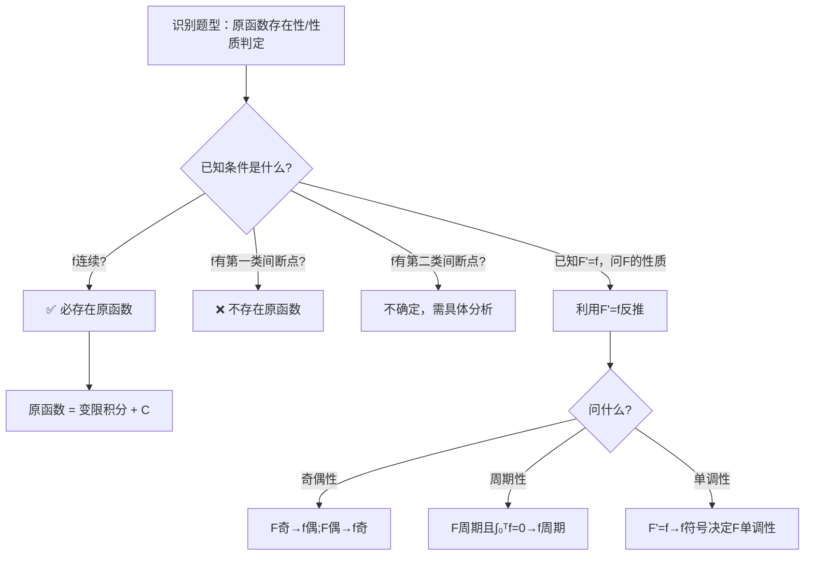

# 题型一：原函数与不定积分的概念

## 识别特征

- 问「$f(x)$ 是否有原函数」或「原函数是否可导」
- 题干涉及间断点类型与可积性的关系
- 给定 $F'(x) = f(x)$，判定 $F(x)$ 的性质
- 涉及「原函数是偶函数则 $f(x)$ 是奇函数」等对称性命题

## 解题流程

## 通法步骤

1. **原函数存在性判定**：
   - $f$ 在区间 $I$ 上连续 $\Rightarrow$ $f$ 在 $I$ 上存在原函数（充分条件）
   - $f$ 有第一类间断点（可去/跳跃）$\Rightarrow$ $f$ 在该区间上**不存在**原函数（导数不可能有第一类间断点）
   - $f$ 有第二类间断点 $\Rightarrow$ 不一定，需具体分析

2. **$F$ 与 $f$ 的关系链**：
   - $F'(x) = f(x)$ $\to$ $F$ 连续且可导
   - $F$ 可导 $\Rightarrow$ $F$ 连续 $\Rightarrow$ $F$ 可积（在闭区间上）
   - 但 $f$ 不一定可导！$F''(x)$ 存在需要 $f'(x)$ 存在

3. **对称性命题速判**：
   - $f$ 是奇函数 $\Rightarrow$ $\int_0^x f(t)dt$ 是偶函数
   - $f$ 是偶函数 $\Rightarrow$ $\int_0^x f(t)dt$ 是奇函数
   - $F$ 是奇函数 $\Rightarrow$ $F' = f$ 是偶函数
   - $F$ 是偶函数 $\Rightarrow$ $F' = f$ 是奇函数

## 常见陷阱

- 「$f(x)$ 可积」不等于「$f(x)$ 有原函数」。$f$ 在 $[a,b]$ 上可积（定积分存在）只需要 $f$ 在 $[a,b]$ 上连续或只有有限个第一类间断点；但 $f$ 有第一类间断点时**没有原函数**
- 「$F(x)$ 是 $f(x)$ 的原函数」$\nRightarrow$ $F(x)$ 二阶可导。只有当 $f(x)$ 可导时 $F(x)$ 才二阶可导
- 原函数定义要求在整个区间上逐点满足 $F' = f$，不能有例外点
- 「$f$ 有原函数」$\neq$「$f$ 的原函数是初等函数」。例如 $f(x)=e^{-x^2}$ 连续 $\Rightarrow$ 原函数存在，但其原函数不是初等函数，无法用有限个初等函数表示。考研中遇此类积分不要强行求初等形式

## 经典母题

> **题目1**（概念题）：$f(x)$ 在 $[-1,1]$ 上有定义，以下哪个命题正确？
> (A) 若 $f$ 有原函数，则 $f$ 必然连续
> (B) 若 $f$ 连续，则 $f$ 必有原函数
> (C) 若 $f$ 可积，则 $f$ 必有原函数
> (D) 若 $f$ 有原函数，则 $f$ 必然可积

**解析**：
- (A) ❌：原函数存在不要求 $f$ 连续。例如 $F(x) = x^2\sin\frac{1}{x}$（$x \neq 0$），$F(0) = 0$，$F'(x) = f(x)$ 存在但 $f(x)$ 在 $x=0$ 不连续
- (B) ✅：连续函数必存在原函数（微积分基本定理第一部分）
- (C) ❌：可积（如分段常函数有跳跃间断点）不一定有原函数
- (D) ❌：有原函数不一定可积（如导数无界的情况）

**答案**：(B)

> **题目2**（奇偶性）：设 $F(x)$ 是 $f(x)$ 在 $(-\infty, +\infty)$ 上的一个原函数。若 $f(x)$ 为奇函数，则 $F(x)$ 是什么函数？

**解析**：$F(x) = \int_0^x f(t)dt + C$。由于 $f$ 为奇函数：
$$F(-x) = \int_0^{-x} f(t)dt + C \xrightarrow{u=-t} -\int_0^x f(-u)du + C = \int_0^x f(u)du + C = F(x)$$
故 $F(x)$ 为偶函数（注意：需要 $C$ 恰当选取，使 $F(0)$ 有意义）。

**答案**：偶函数（当 $F(0) = 0$ 时）
