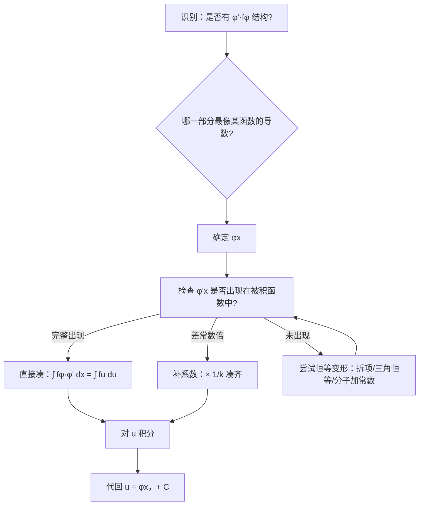

# 题型二：第一类换元法（凑微分法）

## 识别特征

- 被积函数呈现 $\varphi'(x) \cdot f(\varphi(x))$ 的结构
- 分子恰好是分母的导数（或差常数倍）
- 三角函数乘积中一个函数是另一个的导数
- 积分式中出现 $e^x$ 与 $f(e^x)$ 的配对

## 解题流程

## 通法步骤

**Step 1：扫描被积函数，找「函数-导数」配对**

常见配对模式：

| $\varphi(x)$ | $\varphi'(x)$ | 凑微分 |
|-------------|---------------|--------|
| $ax+b$ | $a$ | $\frac{1}{a}d(ax+b)$ |
| $x^n$ | $nx^{n-1}$ | $\frac{1}{n}d(x^n)$ |
| $e^x$ | $e^x$ | $d(e^x)$ |
| $\ln x$ | $\frac{1}{x}$ | $d(\ln x)$ |
| $\sin x$ | $\cos x$ | $d(\sin x)$ |
| $\cos x$ | $-\sin x$ | $-d(\cos x)$ |
| $\tan x$ | $\sec^2 x$ | $d(\tan x)$ |
| $\arcsin x$ | $\frac{1}{\sqrt{1-x^2}}$ | $d(\arcsin x)$ |
| $\arctan x$ | $\frac{1}{1+x^2}$ | $d(\arctan x)$ |

**Step 2：补系数**。若 $\varphi'(x)$ 出现但差常数倍 $k$，则乘 $\frac{1}{k}$ 补足。

**Step 3：转化为基本积分表中的积分**。对 $u$ 积分，然后代回 $\varphi(x)$。

**进阶技巧**：

- **分子凑分母的导数**：$\int \frac{f'(x)}{f(x)}dx = \ln|f(x)| + C$
- **拆项法**：$\int \frac{1}{1-x^2}dx = \frac{1}{2}\int\left(\frac{1}{1-x} + \frac{1}{1+x}\right)dx$
- **三角恒等变形**：$\sin^2 x = \frac{1-\cos 2x}{2}$，$\cos^2 x = \frac{1+\cos 2x}{2}$
- **分子加常数**：$\int \frac{x}{x+1}dx = \int\left(1 - \frac{1}{x+1}\right)dx$

## 常见陷阱

- 忘了补系数：$\int \cos 2x\,dx$，$d(2x) = 2dx$，需要 $\frac{1}{2}\int \cos(2x)\,d(2x)$
- 凑微分方向选错：$\int \sin x\cos x\,dx$ 可以凑 $\frac{1}{2}\sin^2 x$（凑 $\sin$）也可以凑 $-\frac{1}{2}\cos^2 x$（凑 $\cos$），结果等价（差常数）
- 被积函数含绝对值时不能直接凑 $\ln$ 型

## 经典母题

> **题目1**（基础）：$\displaystyle\int \frac{dx}{x(1+\ln x)}$

**解析**：注意到 $\frac{1}{x}dx = d(\ln x)$

令 $u = \ln x$：

$$\int \frac{dx}{x(1+\ln x)} = \int \frac{du}{1+u} = \ln|1+u| + C = \ln|1+\ln x| + C$$

> **题目2**（进阶）：$\displaystyle\int \frac{x^3}{\sqrt{1-x^2}}\,dx$

**解析**：注意到 $x\,dx = \frac{1}{2}d(x^2)$，令 $u = x^2$

$$\int \frac{x^3}{\sqrt{1-x^2}}\,dx = \int \frac{x^2 \cdot x}{\sqrt{1-x^2}}\,dx = \frac{1}{2}\int \frac{u}{\sqrt{1-u}}\,du$$

再令 $t = \sqrt{1-u}$，$u = 1-t^2$，$du = -2t\,dt$：

$$= \frac{1}{2}\int \frac{1-t^2}{t} \cdot (-2t)\,dt = -\int (1-t^2)\,dt = -t + \frac{t^3}{3} + C$$

代回 $t = \sqrt{1-x^2}$ 得最终结果。

**更巧妙的解法**：直接令 $u = \sqrt{1-x^2}$，$x^2 = 1-u^2$，$x\,dx = -u\,du$

$$\int \frac{x^3}{\sqrt{1-x^2}}\,dx = \int \frac{x^2 \cdot x\,dx}{\sqrt{1-x^2}} = \int \frac{(1-u^2)(-u\,du)}{u} = -\int (1-u^2)\,du$$

> **题目3**（真题难度）：$\displaystyle\int \frac{\sin x}{\sin x + \cos x}\,dx$

**解析**：分子分母同除 $\cos x$ 可化为 $\int \frac{\tan x}{\tan x + 1}\,dx$，但更巧妙的做法：

注意到 $\sin x = \frac{1}{2}[(\sin x + \cos x) + (\sin x - \cos x)]$

$$\begin{aligned}
\int \frac{\sin x}{\sin x + \cos x}\,dx
&= \frac{1}{2}\int\left(1 + \frac{\sin x - \cos x}{\sin x + \cos x}\right)dx \\
&= \frac{1}{2}x - \frac{1}{2}\int \frac{(\sin x + \cos x)'}{\sin x + \cos x}\,dx \\
&= \frac{1}{2}x - \frac{1}{2}\ln|\sin x + \cos x| + C
\end{aligned}$$

**启示**：分子分母同类的三角函数有理式，尝试分子拆分出一份分母的导数。
