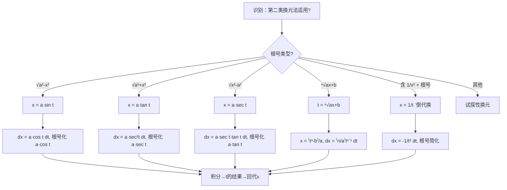

# 题型三：第二类换元法（变量代换法）

## 识别特征

- 被积函数含 $\sqrt{a^2 - x^2}$、$\sqrt{a^2 + x^2}$、$\sqrt{x^2 - a^2}$（三角代换）
- 被积函数含 $\sqrt[n]{ax+b}$ 或 $\sqrt[n]{\frac{ax+b}{cx+d}}$（根式代换）
- 被积函数含 $\frac{1}{x^2}$ 与根式组合（倒代换 $x = \frac{1}{t}$）
- 凑微分法尝试失败后，结构又适合换元

## 解题流程

## 通法步骤

### 1. 三角代换（三种标准模式）

| 根号形式 | 代换 | $dx$ | 根号化为 | 回代用 |
|---------|------|------|---------|--------|
| $\sqrt{a^2-x^2}$ | $x = a\sin t$ | $dx = a\cos t\,dt$ | $a\cos t$ | $t = \arcsin\frac{x}{a}$ |
| $\sqrt{a^2+x^2}$ | $x = a\tan t$ | $dx = a\sec^2 t\,dt$ | $a\sec t$ | 画三角形 |
| $\sqrt{x^2-a^2}$ | $x = a\sec t$ | $dx = a\sec t\tan t\,dt$ | $a\tan t$（$x>a$） | 画三角形 |

**回代技巧——画直角三角形**：

- $x = a\sin t$：对边 $= x$，斜边 $= a$，邻边 $= \sqrt{a^2-x^2}$
- $x = a\tan t$：对边 $= x$，邻边 $= a$，斜边 $= \sqrt{a^2+x^2}$
- $x = a\sec t$：斜边 $= x$，邻边 $= a$，对边 $= \sqrt{x^2-a^2}$

### 2. 根式代换

令整个根式为 $t$，解出 $x$ 的表达式，$dx$ 随之变换。

### 3. 倒代换

当被积函数分母含 $x$ 的幂次远高于分子，或含 $\frac{1}{x^2}$ 与 $\sqrt{1+x^2}$ 组合时，令 $x = \frac{1}{t}$。

### 关键提醒

- 第二类换元**必须回代**到 $x$！答案中不能留 $t$
- 三角代换后注意积分区间对应的 $t$ 范围（定积分时尤其重要）
- 同一道题可能有多种代换方法（三角代换 vs 倒代换 vs 根式代换）

## 常见陷阱

- 忘记回代：第二类换元法最后必须将结果用 $x$ 表示
- 三角代换范围不清：$x = a\sin t$ 时 $t \in [-\frac{\pi}{2}, \frac{\pi}{2}]$，此时 $\cos t \ge 0$，$\sqrt{\cos^2 t} = \cos t$ 去绝对值
- $x = a\sec t$ 时 $x > a$ 和 $x < -a$ 两种情况 $\tan t$ 的符号不同，注意加绝对值
- 回代画三角形时搞错边长关系

## 经典母题

> **题目1**（三角代换基础）：$\displaystyle\int \frac{dx}{(a^2 + x^2)^{3/2}}$

**解析**：令 $x = a\tan t$，$dx = a\sec^2 t\,dt$，$a^2 + x^2 = a^2\sec^2 t$

$$\begin{aligned}
\int \frac{dx}{(a^2+x^2)^{3/2}}
&= \int \frac{a\sec^2 t\,dt}{a^3\sec^3 t}
= \frac{1}{a^2}\int \cos t\,dt \\
&= \frac{1}{a^2}\sin t + C
= \frac{1}{a^2} \cdot \frac{x}{\sqrt{a^2+x^2}} + C
\end{aligned}$$

其中 $\sin t$ 通过三角形回代：对边 $= x$，斜边 $= \sqrt{a^2+x^2}$。

> **题目2**（根式代换）：$\displaystyle\int \frac{dx}{1+\sqrt{x}}$

**解析**：令 $t = \sqrt{x}$，$x = t^2$，$dx = 2t\,dt$

$$\begin{aligned}
\int \frac{dx}{1+\sqrt{x}}
&= \int \frac{2t}{1+t}\,dt
= 2\int\left(1 - \frac{1}{1+t}\right)dt \\
&= 2(t - \ln|1+t|) + C \\
&= 2\sqrt{x} - 2\ln(1+\sqrt{x}) + C
\end{aligned}$$

> **题目3**（倒代换）：$\displaystyle\int \frac{dx}{x\sqrt{x^2-1}}$（$x>1$）

**解析**：

**方法一（三角代换）**：令 $x = \sec t$，$dx = \sec t \tan t\,dt$

$$\int \frac{dx}{x\sqrt{x^2-1}} = \int \frac{\sec t \tan t\,dt}{\sec t \cdot \tan t} = \int dt = t + C = \operatorname{arcsec} x + C$$

**方法二（倒代换）**：令 $x = \frac{1}{t}$，$dx = -\frac{1}{t^2}dt$

$$\int \frac{dx}{x\sqrt{x^2-1}} = \int \frac{-1/t^2\,dt}{(1/t)\sqrt{1/t^2-1}} = -\int \frac{dt}{\sqrt{1-t^2}} = -\arcsin t + C = -\arcsin\frac{1}{x} + C$$

两种形式等价（$\operatorname{arcsec} x = \frac{\pi}{2} - \arcsin\frac{1}{x}$）。

**启示**：同一道题多种代换可行，三角代换直接得 $\operatorname{arcsec} x$，倒代换得 $\arcsin$ 形式——殊途同归。
