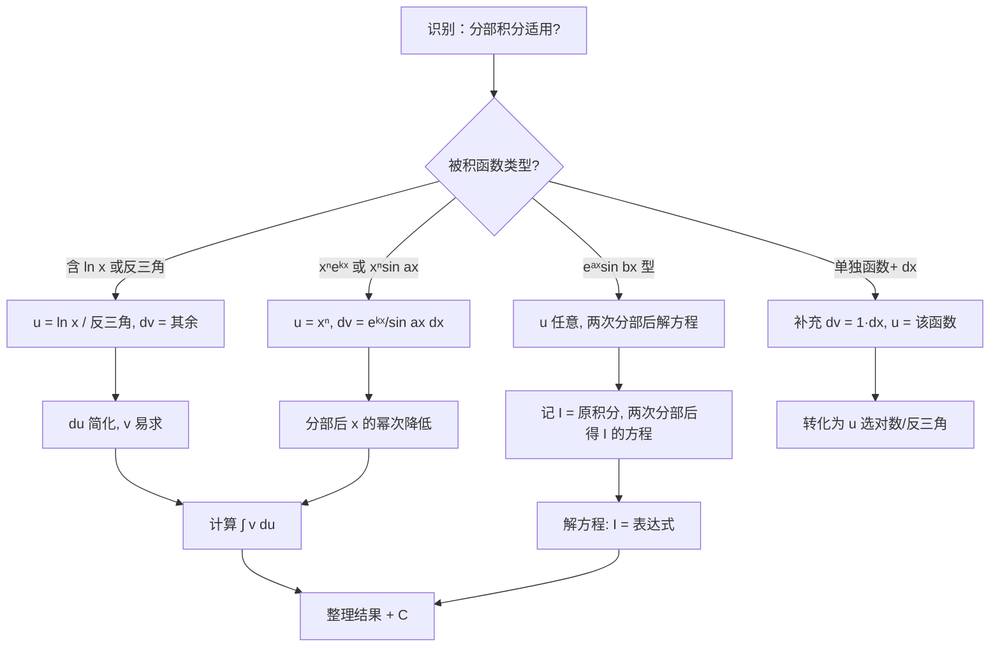

# 题型四：分部积分法

## 识别特征

- 被积函数是**两类不同类型函数的乘积**（幂 × 指、幂 × 三角、指 × 三角等）
- 被积函数含**对数函数** $\ln x$ 或**反三角函数**（$\arcsin x$、$\arctan x$ 等——即使单独出现也是与 $1$ 的乘积）
- 被积函数形如 $e^{ax}\sin bx$ 或 $e^{ax}\cos bx$（两次分部回归型）
- 被积函数含 $x^n f(x)$ 且 $f(x)$ 反复求导/积分有规律

## 解题流程

## 通法步骤

**Step 1：选择 $u$ 和 $dv$**

使用 **LIATE 口诀**（反、对、幂、指、三，排前面的选作 $u$）：
- **L**ogarithm（对数）：$\ln x$ → $u$
- **I**nverse trig（反三角）：$\arcsin x$, $\arctan x$ → $u$
- **A**lgebraic（代数/幂）：$x^n$ → 与指/三配对时选 $u$
- **T**rig（三角）：$\sin x$, $\cos x$ → $dv$
- **E**xponential（指数）：$e^x$ → $dv$

**Step 2：算出 $du$ 和 $v$**
- $du = u'\,dx$
- $v = \int dv$（只需找一个原函数，取 $C = 0$）

**Step 3：代入公式** $\int u\,dv = uv - \int v\,du$

**Step 4：计算 $\int v\,du$**（应比原积分更简单）

**三种经典模式详解**：

| 模式 | 示例 | $u$ | $dv$ | 策略 |
|------|------|-----|------|------|
| 降幂型 | $\int x^n e^x dx$ | $x^n$ | $e^x dx$ | 每分部一次 $x$ 降一次幂，$n$ 次后消去 |
| 消去型 | $\int x \ln x\,dx$ | $\ln x$ | $x\,dx$ | 一次分部 $\ln x$ 变 $\frac{1}{x}$ |
| 回归型 | $\int e^x \sin x\,dx$ | 任意 | 任意 | 两次分部后出现原积分，解方程 |

## 常见陷阱

- $u$ 和 $dv$ 选反导致越积越复杂（经典反例：$\int xe^xdx$ 选 $u=e^x$）
- $\int v\,du$ 中 $v$ 找错（积分常数选错导致后续麻烦——务必取 $C=0$）
- 回归型分部积分两次后忘记加 $C$
- 含 $\ln x$ 的积分中 $x^n\ln x$ 型（$n \neq -1$）可以直接用分部，$n = -1$ 即 $\frac{\ln x}{x}$ 用凑微分更快

## 经典母题

> **题目1**（降幂型）：$\displaystyle\int x^2 e^x\,dx$

**解析**：$u = x^2$，$dv = e^x dx$，$du = 2x\,dx$，$v = e^x$

$$\begin{aligned}
\int x^2 e^x\,dx &= x^2 e^x - \int 2x e^x\,dx \quad\text{（降为一次）}\\
&= x^2 e^x - 2\left[x e^x - \int e^x\,dx\right] \quad\text{（再降为常数）}\\
&= x^2 e^x - 2x e^x + 2e^x + C \\
&= e^x(x^2 - 2x + 2) + C
\end{aligned}$$

**规律**：$\int x^n e^x dx = e^x \sum_{k=0}^n (-1)^{n-k} \frac{n!}{k!} x^k + C$（可以当场推，不必背）

> **题目2**（消去型）：$\displaystyle\int \ln x\,dx$

**解析**：$u = \ln x$，$dv = dx$，$du = \frac{1}{x}dx$，$v = x$

$$\int \ln x\,dx = x\ln x - \int x \cdot \frac{1}{x}\,dx = x\ln x - x + C = x(\ln x - 1) + C$$

> **题目3**（回归型）：$\displaystyle\int e^{2x}\cos 3x\,dx$

**解析**：令 $I = \int e^{2x}\cos 3x\,dx$

第一次分部：$u = \cos 3x$，$dv = e^{2x}dx$，$du = -3\sin 3x\,dx$，$v = \frac{1}{2}e^{2x}$

$$I = \frac{1}{2}e^{2x}\cos 3x + \frac{3}{2}\int e^{2x}\sin 3x\,dx$$

第二次分部（对新积分）：$u = \sin 3x$，$dv = e^{2x}dx$

$$\int e^{2x}\sin 3x\,dx = \frac{1}{2}e^{2x}\sin 3x - \frac{3}{2}\int e^{2x}\cos 3x\,dx = \frac{1}{2}e^{2x}\sin 3x - \frac{3}{2}I$$

代回：

$$I = \frac{1}{2}e^{2x}\cos 3x + \frac{3}{2}\left(\frac{1}{2}e^{2x}\sin 3x - \frac{3}{2}I\right)$$

$$I = \frac{1}{2}e^{2x}\cos 3x + \frac{3}{4}e^{2x}\sin 3x - \frac{9}{4}I$$

$$\frac{13}{4}I = \frac{e^{2x}}{4}(2\cos 3x + 3\sin 3x)$$

$$I = \frac{e^{2x}}{13}(2\cos 3x + 3\sin 3x) + C$$

**启示**：$\int e^{ax}\cos bx\,dx$ 和 $\int e^{ax}\sin bx\,dx$ 成对出现，两次分部回归解出。
