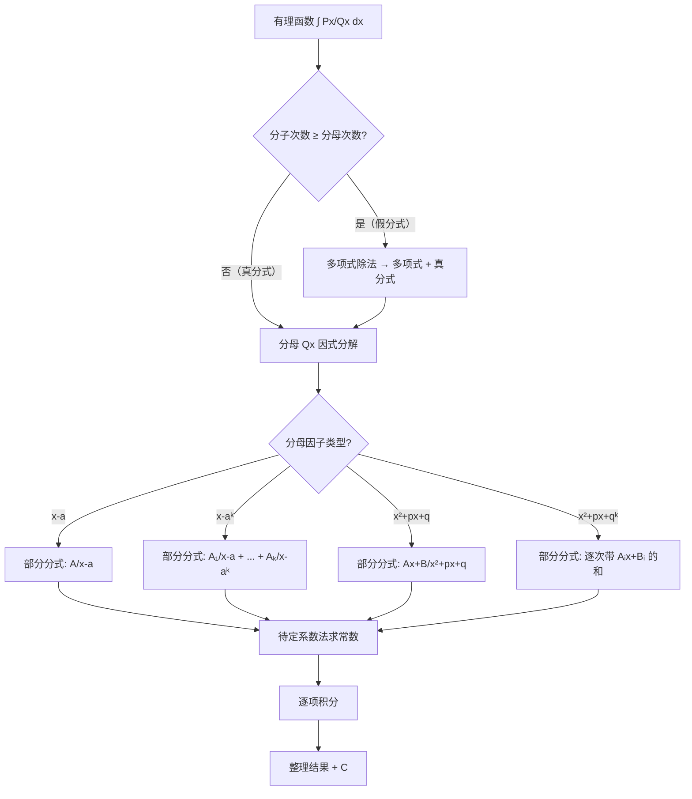

# 题型五：有理函数的积分

## 识别特征

- 被积函数为两个多项式的商 $\frac{P(x)}{Q(x)}$
- 分母可因式分解为一次或二次因式的乘积
- 被积函数为假分式（分子次数 ≥ 分母次数）

## 解题流程

## 通法步骤

### Step 1：化为真分式

若分子次数 ≥ 分母次数，通过**多项式除法**化为「多项式 + 真分式」。

### Step 2：分母因式分解

将 $Q(x)$ 分解为一次因式和判别式 $<0$ 的二次因式的乘积。

### Step 3：拆分为部分分式

| 分母因子 | 部分分式 |
|---------|---------|
| $(x-a)$ | $\frac{A}{x-a}$ |
| $(x-a)^k$ | $\frac{A_1}{x-a} + \frac{A_2}{(x-a)^2} + \cdots + \frac{A_k}{(x-a)^k}$ |
| $x^2+px+q$（$\Delta<0$） | $\frac{Ax+B}{x^2+px+q}$ |
| $(x^2+px+q)^k$ | $\frac{A_1x+B_1}{x^2+px+q} + \cdots + \frac{A_kx+B_k}{(x^2+px+q)^k}$ |

### Step 4：求待定系数

**方法一（赋值法——最快）**：部分分式等式两边同乘分母后，代入 $x$ 为各因式的根。

**方法二（比较系数法）**：通分后比较 $x$ 各次幂的系数，解线性方程组。

**推荐**：赋值法为主 + 比较系数法补充（用于重因式或二次不可约因式）。

### Step 5：逐项积分

三类基本积分：

1. $\int \frac{A}{x-a}dx = A\ln|x-a| + C$
2. $\int \frac{A}{(x-a)^k}dx = -\frac{A}{(k-1)(x-a)^{k-1}} + C$（$k \ge 2$）
3. $\int \frac{Ax+B}{x^2+px+q}dx$：分子拆为「分母导数部分 + 常数部分」
   - 分母导数 $= 2x + p$，凑 $Ax+B = \frac{A}{2}(2x+p) + (B - \frac{Ap}{2})$
   - 前者积分为 $\frac{A}{2}\ln|x^2+px+q|$
   - 后者通过配方化为 $\arctan$ 型

## 常见陷阱

- 假分式不先做多项式除法，直接拆分——会出错
- 二次因式是否可约判断错误：$\Delta = p^2 - 4q$，$\Delta < 0$ 则不可约
- 部分分式遗漏重因式的高次项
- $\int \frac{dx}{x^2+px+q}$ 配方法做错：$x^2+px+q = (x+\frac{p}{2})^2 + (q-\frac{p^2}{4})$

## 经典母题

> **题目1**（基础）：$\displaystyle\int \frac{x+1}{x^2-5x+6}\,dx$

**解析**：分母 $x^2-5x+6 = (x-2)(x-3)$

设 $\frac{x+1}{(x-2)(x-3)} = \frac{A}{x-2} + \frac{B}{x-3}$

两边乘 $(x-2)(x-3)$：
$$x+1 = A(x-3) + B(x-2)$$

**赋值法**：
- $x = 2$：$3 = -A \Rightarrow A = -3$
- $x = 3$：$4 = B \Rightarrow B = 4$

$$\begin{aligned}
\int \frac{x+1}{x^2-5x+6}\,dx &= \int\left(\frac{-3}{x-2} + \frac{4}{x-3}\right)dx \\
&= -3\ln|x-2| + 4\ln|x-3| + C = \ln\left|\frac{(x-3)^4}{(x-2)^3}\right| + C
\end{aligned}$$

> **题目2**（进阶：含不可约二次因式）：$\displaystyle\int \frac{x}{(x^2+1)(x-1)}\,dx$

**解析**：设 $\frac{x}{(x^2+1)(x-1)} = \frac{Ax+B}{x^2+1} + \frac{C}{x-1}$

通分：$x = (Ax+B)(x-1) + C(x^2+1)$

- $x = 1$：$1 = C \cdot 2 \Rightarrow C = \frac{1}{2}$
- 展开比较系数：
  $$x = (Ax+B)(x-1) + \frac{1}{2}(x^2+1)$$
  $$x = Ax^2 - Ax + Bx - B + \frac{1}{2}x^2 + \frac{1}{2}$$
  $$x = (A+\frac{1}{2})x^2 + (-A+B)x + (-B+\frac{1}{2})$$

  比较 $x^2$ 系数：$0 = A + \frac{1}{2} \Rightarrow A = -\frac{1}{2}$
  比较 $1$ 系数：$0 = -B + \frac{1}{2} \Rightarrow B = \frac{1}{2}$

$$\begin{aligned}
\int \frac{x}{(x^2+1)(x-1)}\,dx &= \int\left(\frac{-\frac{1}{2}x + \frac{1}{2}}{x^2+1} + \frac{\frac{1}{2}}{x-1}\right)dx \\
&= -\frac{1}{4}\int\frac{2x}{x^2+1}dx + \frac{1}{2}\int\frac{dx}{x^2+1} + \frac{1}{2}\int\frac{dx}{x-1} \\
&= -\frac{1}{4}\ln(x^2+1) + \frac{1}{2}\arctan x + \frac{1}{2}\ln|x-1| + C
\end{aligned}$$
