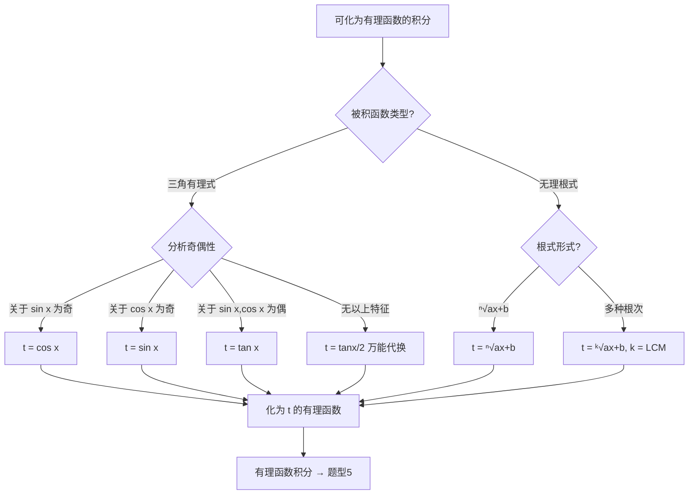

# 题型六：可化为有理函数的积分

## 识别特征

- 被积函数由 $\sin x$、$\cos x$ 经四则运算构成（三角有理式）
- 被积函数含根式 $\sqrt[n]{ax+b}$ 或 $\sqrt[n]{\frac{ax+b}{cx+d}}$（无理函数）
- 上述情形用换元法化为一元有理函数后再积分

## 解题流程

## 通法步骤

### 一、三角有理式 $\int R(\sin x, \cos x)\,dx$

**优先检查特殊情形**（计算量远小于万能代换）：

| 条件 | 代换 | $dx$ 转换 |
|------|------|-----------|
| $R(-\sin x, \cos x) = -R(\sin x, \cos x)$ | $t = \cos x$ | $dt = -\sin x\,dx$ |
| $R(\sin x, -\cos x) = -R(\sin x, \cos x)$ | $t = \sin x$ | $dt = \cos x\,dx$ |
| $R(-\sin x, -\cos x) = R(\sin x, \cos x)$ | $t = \tan x$ | $dx = \frac{dt}{1+t^2}$ |

**万能代换（兜底方案）**：$t = \tan\frac{x}{2}$

$$\sin x = \frac{2t}{1+t^2},\quad \cos x = \frac{1-t^2}{1+t^2},\quad dx = \frac{2}{1+t^2}dt$$

**特例速记**：

- $\int \frac{dx}{\sin x} = \ln|\csc x - \cot x| + C$
- $\int \frac{dx}{\cos x} = \ln|\sec x + \tan x| + C$
- $\int \frac{dx}{1+\cos x} = \tan\frac{x}{2} + C$
- $\int \frac{dx}{1+\sin x} = \tan\left(\frac{x}{2} - \frac{\pi}{4}\right) + C$

### 二、简单无理函数的积分

| 被积函数含 | 代换 | 目的 |
|-----------|------|------|
| $\sqrt[n]{ax+b}$ | $t = \sqrt[n]{ax+b}$ | $x = \frac{t^n-b}{a}$，$dx = \frac{n}{a}t^{n-1}dt$ |
| $\sqrt[n]{\frac{ax+b}{cx+d}}$ | $t = \sqrt[n]{\frac{ax+b}{cx+d}}$ | 解出 $x$ 为 $t$ 的有理函数 |
| 含多种根次 $\sqrt[p]{ax+b}$ 和 $\sqrt[q]{ax+b}$ | $t = \sqrt[k]{ax+b}$，$k = \operatorname{lcm}(p,q)$ | 统一根次 |

## 常见陷阱

- 三角有理式上来就用万能代换：应先检查三种特殊奇偶性
- 万能代换后 $t = \tan\frac{x}{2}$ 的 $dx$ 转换忘写 $\frac{2}{1+t^2}$
- 无理函数代换后忘了 $dx$ 的转换
- 特殊代换判断错误：$R(-\sin x, \cos x) = R(\sin x, \cos x)$ 表示关于 $\sin x$ 为偶函数，不能用 $t = \cos x$

## 经典母题

> **题目1**（三角有理式 — 使用 $t = \cos x$）：$\displaystyle\int \frac{\sin^3 x}{2+\cos x}\,dx$

**解析**：关于 $\sin x$ 为奇函数（$\sin^3(-x) = -\sin^3 x$），且分子可提一个 $\sin x$。

令 $t = \cos x$，$dt = -\sin x\,dx$，$\sin^2 x = 1-t^2$

$$\begin{aligned}
\int \frac{\sin^3 x}{2+\cos x}\,dx &= \int \frac{\sin^2 x \cdot \sin x}{2+\cos x}\,dx
= \int \frac{(1-t^2)(-dt)}{2+t} \\
&= \int \frac{t^2-1}{t+2}\,dt
= \int\left(t-2+\frac{3}{t+2}\right)dt \\
&= \frac{t^2}{2} - 2t + 3\ln|t+2| + C \\
&= \frac{\cos^2 x}{2} - 2\cos x + 3\ln(2+\cos x) + C
\end{aligned}$$

> **题目2**（三角有理式 — 使用 $t = \tan x$）：$\displaystyle\int \frac{dx}{1+\sin^2 x}$

**解析**：$R(-\sin x, -\cos x) = R(\sin x, \cos x)$，关于二者为偶函数。分子分母同除 $\cos^2 x$：

令 $t = \tan x$，$dx = \frac{dt}{1+t^2}$，$\sin^2 x = \frac{t^2}{1+t^2}$

$$\begin{aligned}
\int \frac{dx}{1+\sin^2 x} &= \int \frac{dx}{\cos^2 x + \sin^2 x + \sin^2 x} \quad\text{（小心！不能直接代）}\\
&= \int \frac{dx}{\cos^2 x + 2\sin^2 x}
= \int \frac{\sec^2 x\,dx}{1+2\tan^2 x}
= \int \frac{dt}{1+2t^2} \\
&= \frac{1}{\sqrt{2}}\arctan(\sqrt{2}t) + C
= \frac{1}{\sqrt{2}}\arctan(\sqrt{2}\tan x) + C
\end{aligned}$$

> **题目3**（无理函数）：$\displaystyle\int \frac{dx}{\sqrt{x} + \sqrt[3]{x}}$

**解析**：含 $\sqrt{x}$ 和 $\sqrt[3]{x}$，最小公倍数 $k = \operatorname{lcm}(2,3) = 6$。令 $t = x^{1/6}$，$x = t^6$，$dx = 6t^5dt$

$$\begin{aligned}
\int \frac{dx}{\sqrt{x} + \sqrt[3]{x}} &= \int \frac{6t^5\,dt}{t^3 + t^2}
= 6\int \frac{t^3}{t+1}\,dt \\
&= 6\int\left(t^2 - t + 1 - \frac{1}{t+1}\right)dt \\
&= 6\left(\frac{t^3}{3} - \frac{t^2}{2} + t - \ln|t+1|\right) + C \\
&= 2\sqrt{x} - 3\sqrt[3]{x} + 6\sqrt[6]{x} - 6\ln(\sqrt[6]{x}+1) + C
\end{aligned}$$

> **题目4**（万能代换 — 兜底）：$\displaystyle\int \frac{dx}{3+\cos x}$

**解析**：无特殊奇偶性，直接用万能代换。令 $t = \tan\frac{x}{2}$：

$$\cos x = \frac{1-t^2}{1+t^2},\quad dx = \frac{2}{1+t^2}dt$$

$$\begin{aligned}
\int \frac{dx}{3+\cos x}
&= \int \frac{\frac{2}{1+t^2}}{3 + \frac{1-t^2}{1+t^2}}\,dt
= \int \frac{2}{3(1+t^2) + (1-t^2)}\,dt \\
&= \int \frac{2}{2t^2 + 4}\,dt
= \int \frac{1}{t^2+2}\,dt \\
&= \frac{1}{\sqrt{2}}\arctan\frac{t}{\sqrt{2}} + C
= \frac{1}{\sqrt{2}}\arctan\left(\frac{\tan\frac{x}{2}}{\sqrt{2}}\right) + C
\end{aligned}$$
